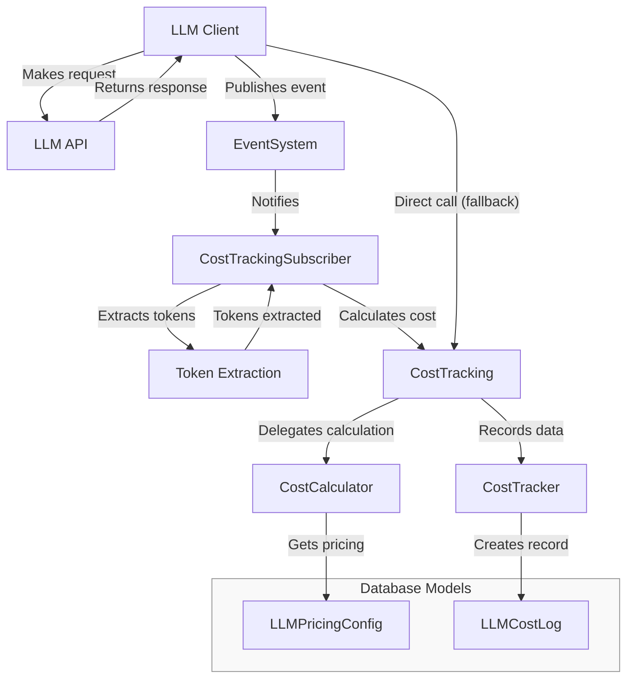

# 🤑 GradeBot Cost Tracking System

## Overview

The cost tracking system in GradeBot provides a mechanism for monitoring, calculating, and recording the costs associated with Large Language Model (LLM) usage. This documentation outlines the architecture, components, and flow of the cost tracking subsystem.

## System Architecture

The cost tracking system uses an event-driven architecture with a fallback mechanism for direct tracking. It consists of the following key components:

1. **EventSystem** - Publishes events when LLM requests are completed
2. **CostTrackingSubscriber** - Listens for LLM request completion events
3. **CostTracking** - Facade module providing an interface to cost tracking functionality
4. **CostCalculator** - Calculates costs based on token usage and model-specific rates
5. **CostTracker** - Records cost data to the database
6. **LLMPricingConfig** - Stores pricing rates for different LLM models
7. **LLMCostLog** - Database model for storing cost tracking data

## System Flow

## Component Details

### CostTrackingSubscriber

Located in `app/services/llm/cost_tracking_subscriber.rb`, this service:
- Subscribes to the `llm.request.completed` event
- Extracts token information from the LLM response
- Calls the CostTracking facade to calculate and record costs
- Handles error states and provides detailed logging

### CostTracking

Located in `app/services/llm/cost_tracking.rb`, this module:
- Provides a simplified interface to cost tracking functionality
- Delegates token cost calculations to CostCalculator
- Delegates cost recording to CostTracker
- Exposes methods to generate tracking context

### CostCalculator

Located in `app/services/llm/cost_calculator.rb`, this service:
- Calculates costs based on token usage and model-specific rates
- Retrieves pricing information from LLMPricingConfig
- Provides pricing rates for reports and analysis
- Includes fallback default rates if no configuration exists

### CostTracker

Located in `app/services/llm/cost_tracker.rb`, this service:
- Generates context information for tracking (request ID, type, etc.)
- Records cost data to the LLMCostLog model
- Provides detailed logging for debugging
- Handles errors during the recording process

### LLMCostLog

Located in `app/models/llm_cost_log.rb`, this ActiveRecord model:
- Stores detailed information about each LLM request cost
- Provides scopes for filtering cost data
- Includes methods for generating cost reports
- Supports cost aggregation by various dimensions (user, model, request type)

## Fallback Mechanism

If the event system fails or is unavailable, the LLM client can directly call CostTracking methods to calculate and record costs. This ensures cost tracking continues even if parts of the system are not functioning properly.

## Cost Calculation

The cost calculation follows these steps:
1. Extract token counts (prompt, completion) from the LLM response
2. Look up the pricing rates for the specific model from LLMPricingConfig
3. Calculate prompt cost: `(prompt_tokens * prompt_rate) / 1,000,000`
4. Calculate completion cost: `(completion_tokens * completion_rate) / 1,000,000`
5. Calculate total cost: `prompt_cost + completion_cost`

## Reporting and Analysis

The LLMCostLog model provides numerous methods for analyzing and reporting costs:
- Total cost across all requests
- Cost breakdown by request type, model, or user
- Daily costs for trend analysis
- Date-range based reporting
- Conversion to cents for precise comparisons

## Extension Points

The cost tracking system can be extended in several ways:
- Adding support for new LLM models by updating LLMPricingConfig
- Creating new report types by extending LLMCostLog
- Adding new dimensions for cost tracking by modifying CostTracker
- Supporting additional events by expanding CostTrackingSubscriber
