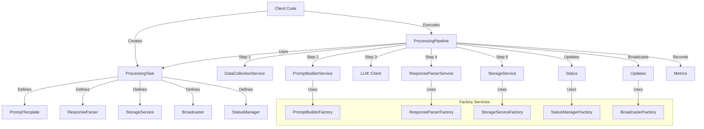

# ProcessingTask Implementation Plan

## Implementation Status

| Step | Description | Status | Notes |
|------|-------------|--------|-------|
| 1 | Create ProcessingTask Service | Completed | Core configuration service |
| 2 | Create ProcessingPipeline Service | Completed | Orchestration service |
| 3 | Create ProcessingResult Value Object | Completed | Return value for pipeline |
| 4 | Create Factory Services | Completed | Response parser, storage, etc. factories |
| 5 | Create Data Collection Service | Completed | Data retrieval for different processables |
| 6 | Create Sample Response Parsers | Completed | Parsers for different LLM responses |
| 7 | Create Sample Storage Services | Not Started | Services to store parsed results |
| 8 | Create ProcessingMetric Model | Not Started | Database model for metrics |
| 9 | Implement Background Job Integration | Not Started | For asynchronous processing |
| 10 | Create Prompt Templates | Not Started | ERB templates for different process types |
| 11 | Write Unit Tests | Completed | For all implemented components |
| 12 | Write Integration Tests | Not Started | End-to-end testing the full pipeline |

## Overview

This document outlines the implementation plan for the ProcessingTask abstraction using a service object approach. This design follows the architecture defined in the PRD, focusing on a clean separation between task configuration and processing execution.

## System Overview

The ProcessingTask abstraction consists of two main components:

1. **ProcessingTask** - A service object that encapsulates configuration and context
2. **ProcessingPipeline** - A service object that orchestrates the processing workflow

Together, these components handle the common pattern of:
1. Collect data
2. Build prompt
3. Send prompt to LLM
4. Parse LLM response
5. Store result

### System Architecture Diagram



## Implementation Steps

### Step 1: Create the ProcessingTask Service

The ProcessingTask service encapsulates all configuration and context for a specific LLM processing task.

```ruby
# app/services/processing_task.rb
class ProcessingTask
  attr_reader :processable, :process_type, :user, :configuration, :context
  attr_accessor :started_at, :completed_at, :error_message, :metrics

  VALID_PROCESS_TYPES = [
    "generate_rubric",
    "grade_student_work",
    "generate_summary_feedback"
  ].freeze
  
  # Initialize a new processing task
  # @param processable [Object] The object being processed (StudentWork, Rubric, etc.)
  # @param process_type [String] The type of processing (e.g., "generate_rubric", "grade_student_work", "generate_summary_feedback")
  # @param user [User] The user initiating the processing
  # @param configuration [OpenStruct] Configuration options for the processing
  # @param context [Hash] Additional context for the processing
  def initialize(processable:, process_type:, user: nil, configuration:, context: {})
    @processable = processable
    @process_type = process_type
    @user = user
    @configuration = configuration.with_indifferent_access
    @context = context.with_indifferent_access
    @metrics = {}.with_indifferent_access
    validate!
  end
  
  # Get the prompt template to use
  # @return [String] The prompt template name
  def prompt_template
    configuration.prompt_template
  end
  
  # Get the response parser to use
  # @return [String] The response parser class
  def response_parser
    configuration.response_parser
  end
  
  # Get the storage service to use
  # @return [String] The storage service class
  def storage_service
    configuration.storage_service
  end
  
  # Get the broadcaster to use
  # @return [String, nil] The broadcaster class
  def broadcaster
    configuration.broadcaster
  end
  
  # Get the status manager to use
  # @return [String, nil] The status manager class
  def status_manager
    configuration.status_manager
  end
  
  # Record when processing starts
  def mark_started
    @started_at = Time.current
  end
  
  # Record when processing completes
  def mark_completed
    @completed_at = Time.current
  end
  
  # Calculate processing time in milliseconds
  # @return [Integer] The processing time in milliseconds
  def processing_time_ms
    return 0 unless started_at && completed_at
    ((completed_at - started_at) * 1000).to_i
  end
  
  def record_metric(key, value)
    @metrics[key] = value
  end

  private
  
  # Validate that required attributes are present
  def validate!
    raise ArgumentError, "Processable is required" unless processable
    raise ArgumentError, "Process type is required" unless process_type
  end
end
```

### Step 2: Create the ProcessingPipeline Service

The ProcessingPipeline service orchestrates the entire workflow from data collection to result storage.

```ruby
# app/services/processing_pipeline.rb
class ProcessingPipeline
  # Initialize with a processing task
  # @param task [ProcessingTask] The task to process
  def initialize(task)
    @task = task
    @logger = Rails.logger
  end
  
  # Execute the processing pipeline
  # @return [ProcessingResult] The result of the processing
  def execute
    @logger.info("Starting processing pipeline for #{@task.process_type} on #{@task.processable.class.name}")
    
    @task.mark_started
    update_status(:processing)
    
    begin
      # Step 1: Collect data
      data = collect_data
      
      # Step 2: Build prompt
      prompt = build_prompt(data)
      
      # Step 3: Send to LLM
      response = send_to_llm(prompt)
      
      # Step 4: Parse response
      parsed_result = parse_response(response)
      
      # Step 5: Store result
      store_result(parsed_result)
      
      # Finalize
      @task.mark_completed
      @task.record_metric(:status, 'completed')
      @task.record_metric(:processing_time_ms, @task.processing_time_ms)
      
      # Record metrics to database
      save_processing_metrics(parsed_result)
      
      update_status(:completed)
      broadcast_update(:completed, parsed_result)
      
      ProcessingResult.new(success: true, data: parsed_result)
    rescue => e
      handle_error(e)
    end
  end
  
  private
  
  # Step 1: Collect data for processing
  def collect_data
    DataCollectionService.for(@task.processable, @task.process_type)
  end
  
  # Step 2: Build prompt using existing PromptBuilder
  def build_prompt(data)
    prompt = PromptBuilder.build(@task.prompt_template, data)
    @task.record_metric(:prompt_length, prompt.length)
    prompt
  end
  
  # Step 3: Send the prompt to the LLM
  def send_to_llm(prompt)
    llm_request = LLMRequest.new(
      prompt: prompt,
      llm_model_name: @task.model_name,
      request_type: @task.process_type,
      trackable: @task.processable,
      user: @task.user,
      metadata: @task.context,
      temperature: @task.configuration[:temperature] || 0.2,
      max_tokens: @task.configuration[:max_tokens] || 4000
    )
    
    response = LLM::Client.new.generate(llm_request)
    @task.record_metric(:tokens, response[:metadata][:tokens])
    response
  end
  
  # Step 4: Parse the LLM response
  def parse_response(response)
    parser = ResponseParserFactory.create(@task.response_parser)
    parsed = parser.parse(response[:content])
    @task.record_metric(:parsed_result_type, parsed.class.name)
    parsed
  end
  
  # Step 5: Store the processed result
  def store_result(result)
    storage = StorageServiceFactory.create(@task.storage_service)
    storage.store(@task.processable, result)
  end
  
  # Update the status of the processable
  def update_status(status)
    return unless @task.status_manager
    
    status_manager = StatusManagerFactory.create(@task.status_manager)
    status_manager.update_status(@task.processable, status)
  end
  
  # Broadcast an update about the processing
  def broadcast_update(event, data = nil)
    return unless @task.broadcaster
    
    broadcaster = BroadcasterFactory.create(@task.broadcaster)
    broadcaster.broadcast(@task.processable, event, data)
  end
  
  # Handle errors during processing
  def handle_error(error)
    @logger.error("Error in processing pipeline: #{error.message}")
    @logger.error(error.backtrace.join("\n"))
    
    @task.error_message = error.message
    @task.record_metric(:status, 'failed')
    @task.record_metric(:error, error.message)
    
    # Record error metrics to database
    save_processing_metrics(nil, error)
    
    update_status(:failed)
    broadcast_update(:failed, { error: error.message })
    
    ProcessingResult.new(success: false, error: error.message)
  end
  
  # Save processing metrics to the ProcessingMetric model
  def save_processing_metrics(result = nil, error = nil)
    metric = ProcessingMetric.new(
      processable: @task.processable,
      process_type: @task.process_type,
      user: @task.user,
      started_at: @task.started_at,
      completed_at: @task.completed_at,
      duration_ms: @task.processing_time_ms,
      status: @task.metrics[:status],
      error_message: error&.message,
      retry_count: @task.metrics[:retry_count] || 0,
      prompt_length: @task.metrics[:prompt_length],
      prompt_template: @task.prompt_template,
      response_parser: @task.response_parser.to_s,
      storage_service: @task.storage_service.to_s
    )
    
    # Add LLM metrics if available
    if @task.metrics[:tokens].present?
      tokens = @task.metrics[:tokens]
      metric.assign_attributes(
        model_name: @task.model_name,
        prompt_tokens: tokens[:prompt],
        completion_tokens: tokens[:completion],
        total_tokens: tokens[:total],
        cost: @task.metrics[:cost]
      )
    end
    
    # Store any additional metrics as metadata
    additional_metrics = @task.metrics.except(
      :status, :error, :retry_count, :prompt_length, 
      :tokens, :cost, :processing_time_ms
    )
    metric.metadata = additional_metrics if additional_metrics.present?
    
    metric.save!
    metric
  end
end
```

### Step 3: Create the ProcessingResult Value Object

```ruby
# app/values/processing_result.rb
class ProcessingResult
  attr_reader :success, :data, :error
  
  def initialize(success:, data: nil, error: nil)
    @success = success
    @data = data
    @error = error
  end
  
  def success?
    @success
  end
  
  def failure?
    !@success
  end
end
```

### Step 4: Factory and Support Services

Leverage existing PromptBuilder and PromptTemplate services and create necessary factory services:

```ruby
# Note: We'll use the existing PromptBuilder service:
# app/services/prompt_builder.rb
# class PromptBuilder
#   def self.build(type, params)
#     begin
#       PromptTemplate.render(type, params)
#     rescue => e
#       Rails.logger.error("Error building prompt: #{e.message}")
#       raise e
#     end
#   end
# end


# app/services/response_parser_factory.rb
class ResponseParserFactory
  def self.create(parser_class)
    # If parser_class is a string, convert to constant
    parser_class = parser_class.constantize if parser_class.is_a?(String)
    parser_class.new
  rescue NameError => e
    Rails.logger.error("Could not instantiate parser class: #{parser_class}")
    raise ArgumentError, "Unknown response parser: #{parser_class}"
  end
end

# app/services/storage_service_factory.rb
class StorageServiceFactory
  def self.create(storage_class)
    # If storage_class is a string, convert to constant
    storage_class = storage_class.constantize if storage_class.is_a?(String)
    storage_class.new
  rescue NameError => e
    Rails.logger.error("Could not instantiate storage class: #{storage_class}")
    raise ArgumentError, "Unknown storage service: #{storage_class}"
  end
end

# app/services/broadcaster_factory.rb
class BroadcasterFactory
  def self.create(broadcaster_class)
    return nil unless broadcaster_class
    
    # If broadcaster_class is a string, convert to constant
    broadcaster_class = broadcaster_class.constantize if broadcaster_class.is_a?(String)
    broadcaster_class.new
  rescue NameError => e
    Rails.logger.error("Could not instantiate broadcaster class: #{broadcaster_class}")
    raise ArgumentError, "Unknown broadcaster: #{broadcaster_class}"
  end
end

# app/services/status_manager_factory.rb
class StatusManagerFactory
  def self.create(status_manager_class)
    return nil unless status_manager_class
    
    # If status_manager_class is a string, convert to constant
    status_manager_class = status_manager_class.constantize if status_manager_class.is_a?(String)
    status_manager_class.new
  rescue NameError => e
    Rails.logger.error("Could not instantiate status manager class: #{status_manager_class}")
    raise ArgumentError, "Unknown status manager: #{status_manager_class}"
  end
end
```

### Step 5: Create Supporting Services

Create the data collection service:

```ruby
# app/services/data_collection_service.rb
class DataCollectionService
  def self.for(processable, process_type)
    case [processable.class.name, process_type]
    when ["StudentWork", "grade_submission"]
      collect_student_work_data(processable)
    when ["Rubric", "format_rubric"]
      collect_rubric_data(processable)
    when ["Assignment", "assignment_summary"]
      collect_assignment_summary_data(processable)
    else
      raise ArgumentError, "Unsupported combination: #{processable.class.name}##{process_type}"
    end
  end
  
  def self.collect_student_work_data(student_work)
    assignment = student_work.assignment
    {
      title: assignment.title,
      description: assignment.description,
      instructions: assignment.instructions,
      grade_level: assignment.grade_level,
      subject: assignment.subject,
      rubric: assignment.rubric.to_prompt,
      student_work: student_work.content,
    }
  end
  
  def self.collect_rubric_data(rubric)
    assignment = rubric.assignment
    data = {
      title: assignment.title,
      description: assignment.description,
      instructions: assignment.instructions,
      grade_level: assignment.grade_level,
      subject: assignment.subject,
    }

    data.merge(raw_rubric_text: assignment.raw_rubric_text) if assignment.raw_rubric_text

    data
  end
  
  def self.collect_assignment_summary_data(assignment)
    {
      title: assignment.title,
      description: assignment.description,
      instructions: assignment.instructions,
      grade_level: assignment.grade_level,
      subject: assignment.subject,
      rubric: assignment.rubric&.to_prompt,
      student_works: assignment.student_works
    }
  end
end
```

Create ERB templates for prompts in the app/views/prompts directory:

```erb
<!-- app/views/prompts/grade_student_work.txt.erb -->
You are an expert educator grading student work.

Assignment: <%= title %>
Description: <%= description %>
Instructions: <%= instructions %>
Grade Level: <%= grade_level %>
Subject: <%= subject %>

Rubric:
<%= rubric %>

Student Work:
<%= student_work %>

Please provide structured feedback including:
1. Overall assessment
2. Strengths (2-3 points)
3. Areas for improvement (1-2 points)
4. Rubric scores with justification
```

```erb
<!-- app/views/prompts/generate_rubric.txt.erb -->
You are an expert educator creating a detailed rubric.

Assignment: <%= title %>
Description: <%= description %>
Instructions: <%= instructions %>
Grade Level: <%= grade_level %>
Subject: <%= subject %>
<% if defined?(raw_rubric_text) && raw_rubric_text.present? %>
Raw Rubric Text:
<%= raw_rubric_text %>
<% end %>

Please generate a structured rubric with 3-5 criteria. Each criterion should have 3-4 levels.
```

```erb
<!-- app/views/prompts/generate_summary_feedback.txt.erb -->
You are an expert educator analyzing multiple student submissions.

Assignment: <%= title %>
Description: <%= description %>
Instructions: <%= instructions %>
Grade Level: <%= grade_level %>
Subject: <%= subject %>

Rubric:
<%= rubric %>

You have reviewed <%= student_works.count %> student submissions.

Please provide a summary analysis including:
1. Overall class performance
2. Common strengths observed
3. Common areas for improvement
4. Suggestions for teacher's next steps
```

Create sample implementations for response parsers:

```ruby
# app/services/structured_feedback_response_parser.rb
class StructuredFeedbackResponseParser
  def parse(content)
    # In a real implementation, this would parse the structured content
    # For example purposes, we'll use a simplified version
    {
      overall_feedback: extract_overall_feedback(content),
      feedback_items: extract_feedback_items(content),
      rubric_scores: extract_rubric_scores(content)
    }
  end
  
  private
  
  def extract_overall_feedback(content)
    # Implementation details...
  end
  
  def extract_feedback_items(content)
    # Implementation details...
    # Returns an array of hashes, each with :kind, :title, :description, and :evidence
    # :kind would be either 'strength' or 'opportunity'
  end
  
  def extract_rubric_scores(content)
    # Implementation details...
  end
end
```

Create sample implementations for storage services:

```ruby
# app/services/student_work_storage_service.rb
class StudentWorkStorageService
  def store(student_work, parsed_result)
    ActiveRecord::Base.transaction do
      # Store overall feedback
      student_work.update!(
        qualitative_feedback: parsed_result[:overall_feedback]
      )
      
      # Store feedback items (both strengths and opportunities)
      parsed_result[:feedback_items].each do |item|
        student_work.feedback_items.create!(
          kind: item[:kind], # 'strength' or 'opportunity'
          title: item[:title],
          description: item[:description], 
          evidence: item[:evidence]
        )
      end
      
      # Store rubric scores
      parsed_result[:rubric_scores].each do |score|
        criterion = student_work.assignment.rubric.criteria.find_by(title: score[:criterion])
        level = criterion.levels.find_by(title: score[:level])
        
        student_work.student_work_criterion_levels.create!(
          criterion: criterion,
          level: level,
          explanation: score[:explanation]
        )
      end
    end
  end
end
```

### Step 6: Usage Example

Here's how to use the ProcessingTask and ProcessingPipeline:

```ruby
# Example: Processing a student submission
class StudentWork::ProcessingService
  def self.process(student_work)
    # Create a processing task
    task = ProcessingTask.new(
      processable: student_work,
      process_type: "grade_student_work",
      user: student_work.assignment.user,
      configuration: OpenStruct.new(
        model: "claude-3-sonnet-20240229",
        temperature: 0.2,
        max_tokens: 4000,
        prompt_template: "grade_student_work",
        response_parser: "GradeStudentWorkResponseParser",
        storage_service: "StudentWorkStorageService",
        broadcaster: "StudentWorkBroadcaster",
        status_manager: "StudentWorkStatusManager"
      ),
      context: {
        assignment_id: student_work.assignment.id,
        student_name: student_work.student_name
      }
    )
    
    # Execute the processing pipeline
    pipeline = ProcessingPipeline.new(task)
    result = pipeline.execute
    
    # Metrics are automatically stored in ProcessingMetric
    
    result
  end
end
```

### Step 7: Integration with Background Jobs

Create a background job to process tasks asynchronously:

```ruby
# app/jobs/processing_task_job.rb
class ProcessingTaskJob < ApplicationJob
  queue_as :processing
  
  def perform(processable_type, processable_id, process_type, user_id = nil, configuration = {}, context = {})
    # Find the processable
    processable_class = processable_type.constantize
    processable = processable_class.find(processable_id)
    
    # Find the user if provided
    user = User.find(user_id) if user_id
    
    # Create the processing task
    task = ProcessingTask.new(
      processable: processable,
      process_type: process_type,
      user: user,
      configuration: configuration,
      context: context
    )
    
    # Execute the pipeline
    pipeline = ProcessingPipeline.new(task)
    result = pipeline.execute
    
    # No need to update the processable directly since metrics are stored in ProcessingMetric
    
    # Handle the result
    if result.failure?
      Rails.logger.error("Processing task failed: #{result.error}")
    end
  end
end
```

Usage example:

```ruby
# Enqueue processing for a student work
ProcessingTaskJob.perform_later(
  "StudentWork",
  student_work.id,
  "grade_submission",
  current_user.id,
  { temperature: 0.2 },
  { assignment_id: student_work.assignment.id }
)
```

## Testing Strategy

Here's a testing strategy for the ProcessingTask system:

1. **Unit Tests**:
   - Test ProcessingTask initialization with various configurations
   - Test ProcessingPipeline with mocked dependencies
   - Test each factory to ensure it returns the correct objects
   - Test supporting services (DataCollectionService, etc.)

2. **Integration Tests**:
   - Test the full pipeline with real implementations
   - Verify proper storage of results
   - Check error handling and retries

3. **Service Tests**:
   - Test specific implementations of prompt builders
   - Test response parsers with sample LLM outputs
   - Test storage services with database transactions

## ProcessingMetric Model

Implement a dedicated model for processing metrics to maintain single responsibility and cleaner modeling:

```ruby
# Add to db/migrate/YYYYMMDDHHMMSS_create_processing_metrics.rb
class CreateProcessingMetrics < ActiveRecord::Migration[8.0]
  def change
    create_table :processing_metrics do |t|
      t.string :prefix_id, index: true
      t.references :processable, polymorphic: true, index: true
      t.string :process_type, null: false
      t.references :user, foreign_key: true
      
      # Timing metrics
      t.datetime :started_at
      t.datetime :completed_at
      t.integer :duration_ms
      
      # LLM metrics
      t.string :model_name
      t.integer :prompt_tokens
      t.integer :completion_tokens
      t.integer :total_tokens
      t.decimal :cost, precision: 10, scale: 6
      
      # Processing details
      t.integer :prompt_length
      t.string :prompt_template
      t.string :response_parser
      t.string :storage_service
      
      # Status and error info
      t.string :status
      t.text :error_message
      t.integer :retry_count, default: 0
      
      # Metadata for additional metrics
      t.jsonb :metadata, default: {}, null: false
      
      t.timestamps
    end
    
    add_index :processing_metrics, :process_type
    add_index :processing_metrics, :status
    add_index :processing_metrics, [:processable_type, :processable_id, :process_type], name: 'index_processing_metrics_on_processable_and_type'
  end
end

# app/models/processing_metric.rb
class ProcessingMetric < ApplicationRecord
  has_prefix_id :prc
  
  # Associations
  belongs_to :processable, polymorphic: true
  belongs_to :user, optional: true
  
  # Validations
  validates :process_type, presence: true
  
  # Scopes
  scope :successful, -> { where(status: 'completed') }
  scope :failed, -> { where(status: 'failed') }
  scope :by_process_type, ->(type) { where(process_type: type) }
  scope :recent, -> { order(created_at: :desc) }
  
  # Methods
  def duration
    return nil unless started_at && completed_at
    completed_at - started_at
  end
  
  def successful?
    status == 'completed'
  end
  
  def failed?
    status == 'failed'
  end
  
  # Class methods for reporting
  def self.average_duration_ms(process_type = nil)
    scope = process_type ? by_process_type(process_type) : all
    scope.successful.average(:duration_ms)
  end
  
  def self.total_cost(process_type = nil)
    scope = process_type ? by_process_type(process_type) : all
    scope.sum(:cost)
  end
  
  def self.total_tokens(process_type = nil)
    scope = process_type ? by_process_type(process_type) : all
    scope.sum(:total_tokens)
  end
end
```

## Conclusion

This implementation plan provides a flexible and maintainable approach to LLM processing tasks using service objects. It follows the architecture outlined in the PRD and adheres to Ruby on Rails best practices. The system is designed to be easily extensible for new types of processing tasks while maintaining a consistent interface.
