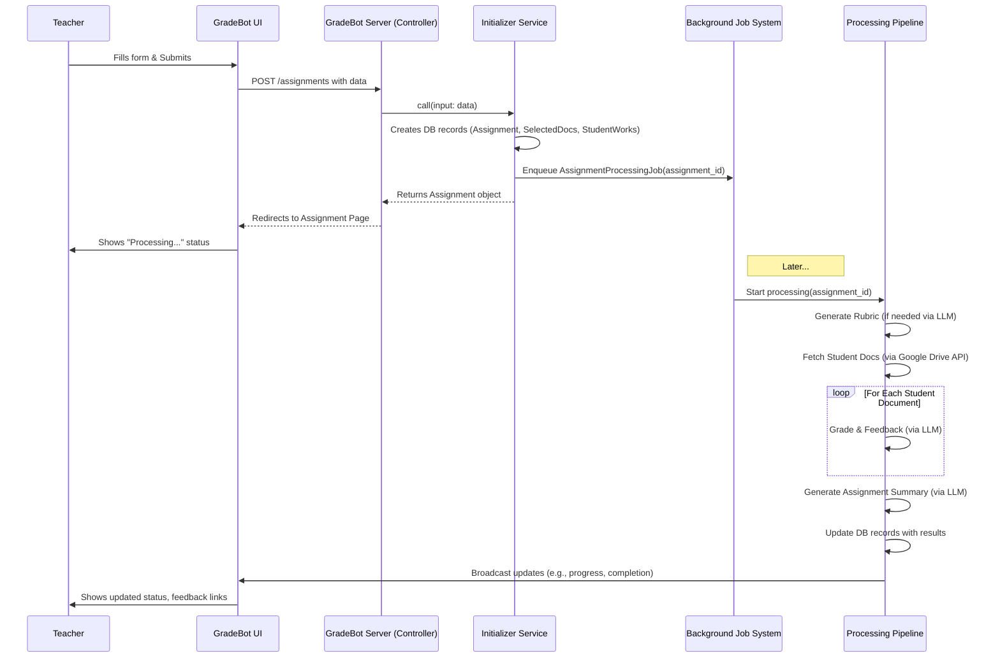

# Chapter 1: Assignment Lifecycle & Processing

Welcome to the GradeBot tutorial! If you're new to GradeBot or even web development, you're in the right place. We'll start with the big picture: how GradeBot takes a teacher's assignment and turns it into graded student work with helpful feedback.

## What's the Big Idea?

Imagine you're a teacher. Grading a stack of essays or reports takes a *lot* of time. You need to read each one, compare it to your rubric (grading guide), write comments, and maybe even summarize how the class did overall. It's important work, but it's repetitive and time-consuming.

GradeBot aims to automate large parts of this grading process. The goal is to let teachers spend less time on the repetitive parts of grading and more time understanding student needs and planning lessons.

This chapter explains the journey an assignment takes within GradeBot, from the moment a teacher creates it to when the graded results are ready. Think of it like an **assembly line for grading**:

1.  **Raw Materials In:** The teacher provides the assignment details (like title and instructions) and selects the student documents (like Google Docs). They might also provide a rubric.
2.  **Automated Stations:** GradeBot takes these materials and runs them through several automated steps in the background:
    *   It might generate a rubric if the teacher didn't provide one.
    *   It fetches the content of each student's document.
    *   It uses a smart AI (like the ones behind ChatGPT, called a Large Language Model or LLM) to read the work, compare it to the rubric, and generate feedback.
    *   It might create summaries of individual student work and the assignment as a whole.
3.  **Finished Products Out:** The system produces graded work, specific feedback for each student, and overall insights for the teacher.

Let's break down how this assembly line works.

## The Journey of an Assignment

The lifecycle starts with the teacher and then moves into GradeBot's automated systems.

### 1. Teacher Creates the Assignment

It all begins when a teacher logs into GradeBot and decides to create a new assignment. They'll fill out a form with information like:

*   **Title:** e.g., "Analysis of The Great Gatsby - Chapter 3"
*   **Subject:** e.g., "English Language Arts"
*   **Grade Level:** e.g., "11th Grade"
*   **Instructions:** What the students were asked to do.

```html
<!-- Example: Part of the new assignment form (simplified) -->
<form action="/assignments" method="post">
  <div>
    <label for="assignment_title">Title</label>
    <input type="text" name="assignment[title]" id="assignment_title">
  </div>
  <div>
    <label for="assignment_instructions">Instructions</label>
    <textarea name="assignment[instructions]" id="assignment_instructions"></textarea>
  </div>
  <!-- ... other fields like subject, grade level ... -->
</form>
```

This form collects the basic details GradeBot needs to understand the assignment context.

### 2. Teacher Selects Student Work

Next, the teacher needs to tell GradeBot which student documents to grade. GradeBot uses the Google Picker tool, which allows the teacher to securely select Google Docs from their Google Drive without leaving GradeBot.

*   The teacher clicks a button like "Select Student Work".
*   The Google Picker pops up.
*   The teacher chooses the relevant student documents (up to a limit, like 35).
*   The selected documents' information (like their unique Google Doc ID and title) is added to the assignment form, often in a hidden way.

This step connects the assignment definition to the actual student work that needs grading. We'll dive deeper into how this Google integration works in [Chapter 3: Google Drive Integration & Document Selection](03_google_drive_integration___document_selection_.md).

### 3. Teacher Handles the Rubric (Optional)

A rubric is a scoring guide that breaks down the assignment criteria. Teachers have two choices:

*   **Provide a Rubric:** They can paste their existing rubric text into a field.
*   **Generate with AI:** They can ask GradeBot to create a rubric based on the assignment instructions using its AI capabilities.

### 4. Teacher Submits & Background Processing Begins

Once the form is filled, documents are selected, and rubric choice is made, the teacher hits "Submit for grading".

This is where the teacher's active role ends for a bit, and GradeBot's automated assembly line kicks into high gear behind the scenes. The web browser will usually redirect the teacher to a page showing the assignment's status, which will update as GradeBot works.

What happens when the teacher clicks submit? The browser sends all the collected information (title, instructions, selected document IDs, rubric text or choice) to the GradeBot server. The server receives this information and starts a series of background tasks.

```ruby
# Example: Simplified Controller Action (assignments_controller.rb)
# This code runs on the server when the form is submitted.

class AssignmentsController < ApplicationController
  def create
    # 1. Prepare input data from the submitted form
    assignment_input = Assignment::InitializerServiceInput.new(
      user: current_user,
      params: assignment_params # Data from the form
    )

    # 2. Call a special 'service' to handle the complex setup
    # This service acts like the foreman starting the assembly line.
    @assignment = Assignment::InitializerService.call(input: assignment_input)

    if @assignment # If the service succeeded...
      # 3. Redirect teacher to the assignment's status page
      redirect_to @assignment, notice: "Assignment created and processing started."
    else
      # If something went wrong (e.g., missing info), show the form again
      render :new, status: :unprocessable_entity
    end
  end

  private

  # Helper to securely get the form data
  def assignment_params
    params.require(:assignment).permit(
      :title, :subject, :grade_level, :instructions,
      :rubric_text, :rubric_option, :feedback_tone,
      document_data: [:googleDocId, :title, :url] # Allow selected doc info
    )
  end
end
```

This controller code is like the receiving dock of our assembly line. It takes the raw materials (form data), packages them up (`assignment_input`), and hands them off to the first stage of the automated process, handled by something called an `Assignment::InitializerService`. We'll learn more about these "Service Objects" in [Chapter 6: Service Objects Pattern](06_service_objects_pattern_.md).

### 5. The Automated Assembly Line Stations

The `Assignment::InitializerService` is responsible for setting up the initial records in the database and kicking off the main background processing.

```ruby
# Example: Simplified Initializer Service (assignment/initializer_service.rb)
# This service sets up the basic records and starts the background work.

module Assignment
  class InitializerService
    # Simplified for clarity - the real one does more!
    attr_reader :assignment

    def self.call(input:)
      new(input).call
    end

    def initialize(input)
      @input = input
      @assignment = nil
    end

    def call
      # Use a transaction: If any step fails, undo everything
      ActiveRecord::Base.transaction do
        # 1. Create the main Assignment record in the database
        @assignment = create_assignment_record

        # 2. Create records for each selected Google Doc
        create_selected_documents

        # 3. Create placeholder records for each student's work
        create_student_works

        # 4. Tell the background system to start the *real* work
        enqueue_processing_job

        # If we reach here, everything worked!
      end
      @assignment # Return the created assignment
    rescue ActiveRecord::RecordInvalid => e
      # Something failed (like missing title), log error, transaction rolls back
      Rails.logger.error("Assignment creation failed: #{e.message}")
      false # Indicate failure
    end

    private

    def create_assignment_record
      # Creates the main record using data from @input
      # (Details omitted for simplicity)
      Assignment.create!(...)
    end

    def create_selected_documents
      # Creates records linking the selected Google Docs to this assignment
      # Uses another service: SelectedDocument::BulkCreationService
      # (Details omitted for simplicity)
      SelectedDocument::BulkCreationService.call(...)
    end

    def create_student_works
      # Creates initial 'StudentWork' records, one for each selected doc
      # These will hold the feedback later. Uses StudentWork::BulkCreationService.
      # (Details omitted for simplicity)
      StudentWork::BulkCreationService.call(...)
    end

    def enqueue_processing_job
      # This puts a message in a queue telling the background
      # system (SolidQueue) to run the full grading process.
      AssignmentProcessingJob.perform_later(@assignment.id)
    end
  end
end
```

This service does a few crucial things:
*   It creates the necessary records in GradeBot's database using [Core Data Models (ActiveRecord)](02_core_data_models__activerecord__.md). These models store all the information about the assignment, the selected documents, and eventually, the grading results.
*   It uses `ActiveRecord::Base.transaction` to ensure that either *all* initial records are created successfully, or *none* are. This prevents assignments from being left in a half-finished state if an error occurs.
*   Most importantly, it calls `AssignmentProcessingJob.perform_later(@assignment.id)`. This tells GradeBot's background job system (SolidQueue) to start the heavy lifting for this specific assignment (identified by `@assignment.id`). This job runs separately, so the teacher doesn't have to wait on the web page.

### 6. Background Processing: The Real Work

The `AssignmentProcessingJob` picks up where the initializer left off. It orchestrates the remaining steps, which often involve communicating with external services like Google Drive and the LLM.

Here's a simplified flow of what typically happens in the background job:



Let's look at the key "stations" in this background processing pipeline:

1.  **Rubric Generation (Optional):** If the teacher requested it, the system sends the assignment instructions to the [LLM Integration & Resilience](04_llm_integration___resilience_.md) component, asking it to generate a structured rubric. The result is saved.
2.  **Fetch Student Work:** For each `SelectedDocument`, the system uses the [Google Drive Integration & Document Selection](03_google_drive_integration___document_selection_.md) component to securely fetch the actual text content of the student's Google Doc.
3.  **LLM Grading & Feedback:** This is the core grading step. For *each* student's work, the system:
    *   Bundles the student's document text, the assignment instructions, and the rubric.
    *   Sends this bundle to the [LLM Integration & Resilience](04_llm_integration___resilience_.md) component.
    *   Asks the LLM to provide structured feedback, scores based on the rubric, overall comments, etc.
    *   Saves this feedback associated with the specific `StudentWork` record in the database.
4.  **Assignment Summary (Optional):** After all individual documents are processed, the system might gather all the feedback and ask the LLM to generate an overall summary for the teacher, highlighting common strengths or areas for improvement across the class.
5.  **Status Updates:** Throughout this process, the system updates the status of the assignment and individual student works (e.g., from `pending` to `processing` to `completed` or `failed`). It often uses real-time communication (Action Cable/Turbo Streams) to update the teacher's view on the assignment page without them needing to refresh.

### 7. Finished Product: Graded Work Ready

Once all background tasks are complete, the assignment status changes to "Completed". The teacher can then view:

*   The original assignment details.
*   The final rubric (generated or provided).
*   A list of all student works.
*   For each student work, detailed AI-generated feedback, rubric scores, and comments.
*   The overall assignment summary (if generated).

The teacher can review the AI's feedback, potentially edit it, and even send it back to the students' Google Docs.

## Conclusion

You've now seen the entire journey of an assignment in GradeBot – our "grading assembly line". It starts with the teacher providing the raw materials (assignment details, student docs) and ends with GradeBot delivering the finished products (graded work, feedback, summaries).

This process involves several key parts working together: the user interface the teacher interacts with, controller actions handling web requests, service objects orchestrating setup, background jobs doing the heavy lifting, and integrations with external systems like Google Drive and AI models (LLMs).

Understanding this lifecycle is fundamental to understanding how GradeBot works. In the next chapter, we'll zoom in on the foundation of how GradeBot stores all this information by looking at its [Chapter 2: Core Data Models (ActiveRecord)](02_core_data_models__activerecord__.md).

---

Generated by [AI Codebase Knowledge Builder](https://github.com/The-Pocket/Tutorial-Codebase-Knowledge)