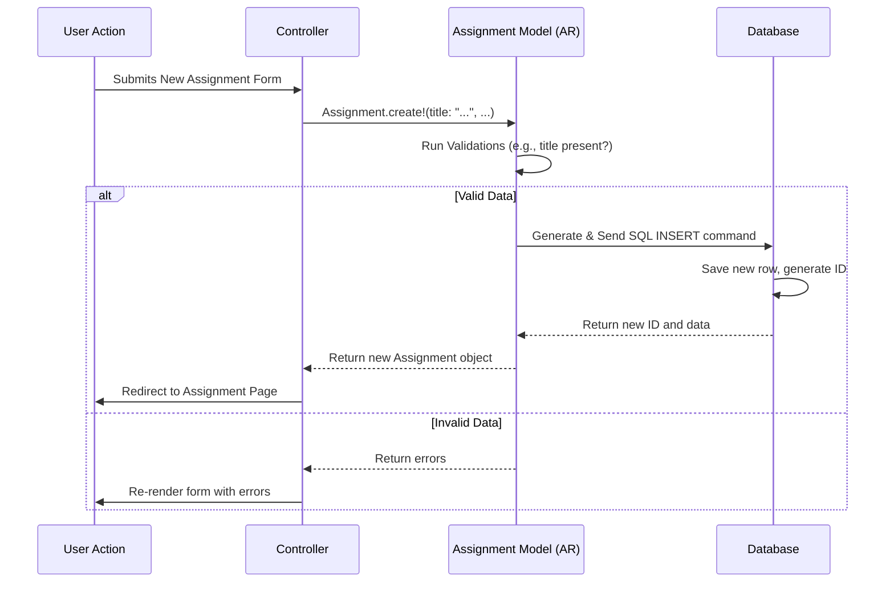

# Chapter 2: Core Data Models (ActiveRecord)

In [Chapter 1: Assignment Lifecycle & Processing](01_assignment_lifecycle___processing_.md), we saw the journey an assignment takes from creation to completion. We mentioned that GradeBot needs to *store* information about assignments, student work, rubrics, and users along the way. But how does it keep track of all this data?

That's where **Core Data Models** come in. Think of GradeBot like an organized office. Chapter 1 showed the workflow (how tasks move from desk to desk). This chapter explains the filing cabinets and folders used to store all the important papers.

## Why Do We Need Data Models? Filing Cabinets for Code!

Imagine trying to run GradeBot without saving anything. A teacher creates an assignment, GradeBot processes it... and then what? If the teacher closes their browser or the server restarts, all that information vanishes! Applications need a way to *persist* data – to save it somewhere permanent so it can be retrieved later.

This permanent storage is usually a **database**. You can think of a database as a set of digital filing cabinets.

But how does our Ruby code interact with these filing cabinets? We need blueprints! **Data Models** are like the blueprints for the folders and information sheets within our filing cabinets (the database). They define:

1.  **What kind of information** we store (e.g., for an assignment, we store a title, instructions, subject).
2.  **How different pieces of information relate** to each other (e.g., an assignment *has* many pieces of student work associated with it).
3.  **Rules** about the information (e.g., every assignment *must* have a title).

In GradeBot, which is built with Ruby on Rails, these blueprints are Ruby classes that use a powerful tool called **ActiveRecord**.

## What is ActiveRecord? The Magic Link

ActiveRecord is a core part of Ruby on Rails. It acts like a magical translator between your Ruby code (the models) and the database (the filing cabinet). It handles the tricky task of saving your Ruby objects into database tables and loading data from the database back into Ruby objects.

The magic often follows a simple convention:

*   A Ruby class named `Assignment` (singular, capitalized) automatically maps to a database table named `assignments` (plural, lowercase).
*   A Ruby class named `User` maps to a `users` table.
*   A Ruby class named `StudentWork` maps to a `student_works` table.

This convention means you don't have to write complicated code to talk to the database most of the time. ActiveRecord handles it for you!

## Meet the Core Models in GradeBot

GradeBot uses several models to represent its core concepts. Here are some of the most important ones:

*   `User`: Represents a teacher using GradeBot. Stores information like their name and email (linked to their Google account).
*   `Assignment`: Represents a task the teacher wants graded (e.g., "Chapter 3 Essay"). Stores the title, instructions, subject, etc.
*   `SelectedDocument`: Represents a specific Google Doc the teacher selected for grading as part of an `Assignment`. Stores the Google Doc ID, title, and URL.
*   `StudentWork`: Represents a single student's submission for an `Assignment`. This is where the AI feedback, scores, and status (pending, processing, completed) will be stored. It's linked to a `SelectedDocument`.
*   `Rubric`: Represents the overall scoring guide for an `Assignment`.
*   `Criterion`: Represents a single row or category within a `Rubric` (e.g., "Clarity", "Use of Evidence").
*   `Level`: Represents a performance level within a `Criterion` (e.g., "Excellent", "Satisfactory", "Needs Improvement").
*   `FeedbackItem`: Represents a specific piece of feedback (a strength or opportunity) generated for a `StudentWork`.
*   `AssignmentSummary`: Stores the overall AI-generated summary for the entire assignment after all `StudentWork` is processed.

Let's look at a *very* simplified version of what the `Assignment` model's code might look like:

```ruby
# app/models/assignment.rb

# This class defines the 'blueprint' for assignments.
# It inherits from ApplicationRecord, which gives it ActiveRecord powers.
class Assignment < ApplicationRecord
  # ActiveRecord figures out the table name ('assignments')
  # and the columns (like 'title', 'subject', 'instructions')
  # automatically by looking at the database structure!

  # We'll add more here later (like relationships and rules).
end
```

This simple class doesn't look like much, but because it inherits from `ApplicationRecord` (which uses ActiveRecord), it already knows how to find the `assignments` table in the database and interact with columns like `title`, `subject`, `grade_level`, and `instructions`.

## Mapping Objects to Database Rows

ActiveRecord connects Ruby objects to database rows:

*   **Class <-> Table:** The `Assignment` class maps to the `assignments` table.
*   **Object <-> Row:** An *instance* of the `Assignment` class (a specific assignment object in Ruby) corresponds to a single *row* in the `assignments` table.
*   **Attribute <-> Column:** An *attribute* of the object (like `@assignment.title`) corresponds to the value in a specific *column* (like the `title` column) for that row.

Imagine our `assignments` table looks like this:

| id  | title                     | subject                | grade\_level |
| :-: | :------------------------ | :--------------------- | :----------- |
| 1   | "Gatsby Chapter 3 Essay"  | "English Language Arts"| "11th Grade" |
| 2   | "Photosynthesis Lab Report" | "Science"              | "9th Grade"  |

If we load the first assignment in Ruby:

```ruby
# Find the assignment with id=1 in the database
assignment_one = Assignment.find(1)

# Now, assignment_one is a Ruby object representing that row.
puts assignment_one.title # Output: Gatsby Chapter 3 Essay
puts assignment_one.subject # Output: English Language Arts
```

ActiveRecord automatically reads the data from row `1` and makes it available as attributes on the `assignment_one` object.

## Connecting the Dots: Relationships Between Models

Data rarely exists in isolation. A teacher (`User`) creates many `Assignments`. An `Assignment` has many `StudentWorks`. A `Rubric` has many `Criteria`, and each `Criterion` has many `Levels`.

ActiveRecord makes defining these connections easy using **associations**:

```ruby
# app/models/assignment.rb
class Assignment < ApplicationRecord
  # An Assignment belongs to one User (the teacher who created it)
  belongs_to :user

  # An Assignment can have many pieces of StudentWork associated with it
  has_many :student_works

  # An Assignment can have many SelectedDocuments (the Google Docs chosen)
  has_many :selected_documents

  # An Assignment can have one Rubric
  has_one :rubric

  # An Assignment can have one summary report
  has_one :assignment_summary

  # ... other code ...
end
```

```ruby
# app/models/student_work.rb
class StudentWork < ApplicationRecord
  # Each StudentWork belongs to exactly one Assignment
  belongs_to :assignment

  # A StudentWork is based on one SelectedDocument
  belongs_to :selected_document

  # A StudentWork can have many specific FeedbackItems
  has_many :feedback_items

  # ... other code ...
end
```

These `belongs_to` and `has_many` lines tell ActiveRecord about the relationships. This allows us to easily navigate between related data:

```ruby
# Get an assignment
assignment = Assignment.find(1)

# Get the teacher who created it
teacher = assignment.user # Uses the `belongs_to :user` relationship

# Get all student work submitted for this assignment
submissions = assignment.student_works # Uses the `has_many :student_works`

# Get the assignment for a specific student work
work = StudentWork.find(5)
parent_assignment = work.assignment # Uses the `belongs_to :assignment`
```

This makes working with connected data much more intuitive!

## Setting the Rules: Validations

Models are also the place to define rules about the data. For instance, we probably don't want to save an `Assignment` without a title. ActiveRecord **validations** enforce these rules:

```ruby
# app/models/assignment.rb
class Assignment < ApplicationRecord
  belongs_to :user
  has_many :student_works
  # ... other associations ...

  # --- Validations ---
  # Ensure an assignment always has a title before saving.
  validates :title, presence: true
  # Ensure it always has instructions.
  validates :instructions, presence: true
  # Ensure it belongs to a user.
  validates :user, presence: true

  # ... other code ...
end
```

With `validates :title, presence: true`, if you try to save an `Assignment` object where the `title` attribute is empty or `nil`, ActiveRecord will prevent the save and report an error. This helps maintain data quality.

## How Models Were Used in Chapter 1

Remember the `Assignment::InitializerService` from Chapter 1? It used models to create the initial database records:

```ruby
# Simplified snippet from assignment/initializer_service.rb

# ... inside the 'call' method ...
def create_assignment_record
  # Uses the Assignment model to create a new row
  # in the 'assignments' table with data from the form (@input).
  Assignment.create!(
    title: @input.params[:title],
    instructions: @input.params[:instructions],
    subject: @input.params[:subject],
    grade_level: @input.params[:grade_level],
    user: @input.user # Link it to the current teacher
    # ... other attributes ...
  )
end

def create_selected_documents
  # Uses the SelectedDocument model (via a service)
  # to create rows in the 'selected_documents' table.
  SelectedDocument::BulkCreationService.call(
    assignment: @assignment, # Link to the assignment we just created
    documents_data: @input.document_data # Data from Google Picker
  )
end

def create_student_works
  # Uses the StudentWork model (via a service)
  # to create placeholder rows in the 'student_works' table,
  # linked to the assignment and selected documents.
  StudentWork::BulkCreationService.call(
    assignment: @assignment
  )
end
# ...
```

When `Assignment.create!(...)` is called, the `Assignment` model (using ActiveRecord) takes the provided attributes (like title, instructions) and:

1.  Checks if they pass the validations (like `validates :title, presence: true`).
2.  If valid, it generates the necessary database command (SQL `INSERT` statement).
3.  Sends the command to the database to create a new row in the `assignments` table.
4.  Returns a new `Assignment` Ruby object representing that saved row.

## Under the Hood: ActiveRecord's Magic Show

How does `Assignment.find(1)` or `assignment.student_works` actually work? ActiveRecord does the heavy lifting behind the scenes.

1.  **Finding Data:** When you call `Assignment.find(1)`, ActiveRecord translates this into a database query language called SQL, something like `SELECT * FROM assignments WHERE id = 1 LIMIT 1`. It sends this SQL to the database. The database finds the row and sends the data back. ActiveRecord then takes that raw data and builds a proper `Assignment` Ruby object with all the attributes populated.
2.  **Saving Data:** When you change an attribute (e.g., `assignment.title = "New Title"`) and call `assignment.save`, ActiveRecord figures out what changed. It generates SQL like `UPDATE assignments SET title = 'New Title' WHERE id = 1`. It sends this to the database to update the row. If it's a new object, it generates an `INSERT` statement instead.
3.  **Following Relationships:** When you call `assignment.student_works`, ActiveRecord knows (from `has_many :student_works`) that it needs to look in the `student_works` table for rows where the `assignment_id` column matches the `id` of the `assignment` object. It generates SQL like `SELECT * FROM student_works WHERE assignment_id = 1`, runs the query, and returns an array of `StudentWork` objects.

Here's a simplified view of creating an assignment:



ActiveRecord acts as the intermediary, translating between the object-oriented world of Ruby and the relational world of the database.

## Conclusion

We've seen that Core Data Models, powered by ActiveRecord, are the backbone of how GradeBot stores and manages its information. They act as blueprints defining the structure (`User`, `Assignment`, `StudentWork`), relationships (`has_many`, `belongs_to`), and rules (validations) for the application's data. Understanding these models is crucial because they represent the fundamental entities GradeBot works with. They are the code representation of our digital filing system.

In the next chapter, we'll explore how GradeBot interacts with data stored *outside* its own database, specifically focusing on how it securely accesses student documents stored in Google Drive. Get ready for [Chapter 3: Google Drive Integration & Document Selection](03_google_drive_integration___document_selection_.md)!

---

Generated by [AI Codebase Knowledge Builder](https://github.com/The-Pocket/Tutorial-Codebase-Knowledge)