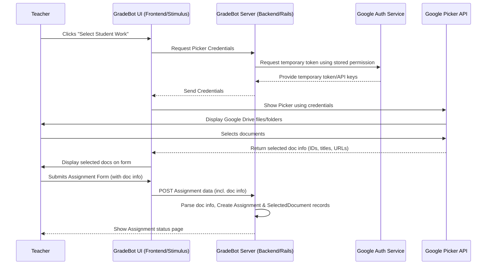

# Chapter 3: Google Drive Integration & Document Selection

In [Chapter 2: Core Data Models (ActiveRecord)](02_core_data_models__activerecord__.md), we learned how GradeBot uses models like `Assignment` and `SelectedDocument` to organize and store information in its database, like digital filing cabinets. But what about the actual student essays or reports? Often, teachers have these stored as Google Docs in their Google Drive.

This chapter explains how GradeBot securely connects to a teacher's Google Drive so they can choose the specific student documents that need grading for an assignment.

## Why Connect to Google Drive?

Imagine a teacher wants GradeBot to help grade 25 essays. The students submitted them as Google Docs. How does GradeBot get access to read those essays? The teacher could download each one and upload it, but that's tedious!

It's much easier if GradeBot can directly ask the teacher, "Which documents in your Google Drive should I grade for this assignment?" That's the problem this chapter's concept solves: **securely accessing specific Google Docs selected by the teacher.**

## The Challenge: Accessing Private Files Securely

Your Google Drive is private. You wouldn't want an app to have access to *all* your files just to grade a few documents. It's like needing someone to pick up a specific package from your house – you wouldn't give them the keys to your entire house! You'd just give them permission to grab that one package while you watch.

GradeBot needs a similar secure way to *only* access the files the teacher explicitly chooses, and only when the teacher allows it.

## The Solution: A Secure Courier Service (Google APIs)

GradeBot uses official tools provided by Google (specifically, **OAuth 2.0** and the **Google Picker API**) to act like a secure courier service.

1.  **Getting Permission (OAuth 2.0):** When a teacher first connects their Google account to GradeBot, Google asks the teacher, "Is it okay for GradeBot to ask for permission to view files you select?" The teacher clicks "Allow" on Google's screen. This doesn't give GradeBot access yet, just permission to *ask* later. Think of this as the teacher telling the building security, "It's okay if GradeBot's courier rings my doorbell later."
2.  **Picking Up the Files (Google Picker API):** When the teacher is creating an assignment in GradeBot and clicks "Select Student Work", GradeBot uses this permission to ask Google to show the teacher their own Drive files in a special pop-up window (the Google Picker). This pop-up comes *directly from Google*. The teacher selects the documents they want graded *within this secure Google window*.
3.  **Delivering the Info:** Once the teacher confirms their selection, Google tells GradeBot *only* the unique IDs, titles, and web links (URLs) of the documents the teacher picked. GradeBot *never* sees the teacher's Google password and only gets information about the selected files. It's like the courier service only gets a list of tracking numbers for the packages they are allowed to handle.

This process involves two main parts of GradeBot working together: the **frontend** (what the teacher sees and interacts with in their browser) and the **backend** (the main GradeBot server logic).

## How It Works: The Teacher's View (Frontend)

Let's follow the teacher's steps:

1.  **Click the Button:** On the new assignment form, the teacher clicks a button like "Select student work".

    ```html
    <!-- Simplified button on the assignment form -->
    <div data-controller="doc-picker">
      <button type="button" data-action="click->doc-picker#showPicker" data-doc-picker-target="button">
        Select Student Work
      </button>
      <!-- Hidden input to store selected doc info -->
      <input type="hidden" data-doc-picker-target="documentData" name="assignment[document_data]">
      <!-- ... other targets for displaying selected docs ... -->
    </div>
    ```
    This button is managed by a piece of frontend code called a Stimulus controller, specifically `doc_picker_controller.js`. We'll learn more about these in [Chapter 5: Stimulus Controllers (Frontend Interactivity)](05_stimulus_controllers__frontend_interactivity_.md).

2.  **Google Picker Appears:** Clicking the button triggers the `showPicker` action in the Stimulus controller. This controller asks the GradeBot backend for temporary credentials (like a temporary entry pass) and then uses Google's code to display the Google Picker pop-up window.

3.  **Select Documents:** The teacher navigates their Drive folders inside the Google Picker window and selects the student Google Docs. They can select multiple files (up to a limit, like 35).

4.  **Confirm Selection:** The teacher clicks "Select" (or similar) in the Google Picker window.

5.  **Update GradeBot Form:** The Picker window closes. The Stimulus controller receives the list of selected documents (their IDs, titles, URLs) from Google. It then updates the GradeBot assignment form, often by:
    *   Putting the document information into a hidden input field (`documentData` target).
    *   Displaying the names and links of the selected documents so the teacher can see what they chose.

Here's a tiny part of the Stimulus controller (`doc_picker_controller.js`) that handles receiving the selected documents:

```javascript
// app/javascript/controllers/doc_picker_controller.js (Simplified)

export default class extends Controller {
  // ... targets and other methods ...

  handlePickerResponse(data) {
    // Check if the user actually picked documents
    if (data[google.picker.Response.ACTION] == google.picker.Action.PICKED) {
      const docs = data[google.picker.Response.DOCUMENTS];
      if (docs.length > 0) {
        // Process the selected documents
        this.handleDocumentsSelection(docs);
      }
    }
  }

  handleDocumentsSelection(docs) {
    // Extract needed info (ID, title, URL) for each doc
    const documentData = docs.map(doc => ({
      title: doc[google.picker.Document.NAME],
      googleDocId: doc[google.picker.Document.ID], // The unique Google Doc ID
      url: doc[google.picker.Document.URL],
    }));

    // Store this data in the hidden form field
    this.documentDataTarget.value = JSON.stringify(documentData);

    // Update the UI to show the selected document list (simplified)
    this.updateDocumentList(documentData);
  }

  // ... other methods like updateDocumentList, fetchCredentials ...
}
```
This Javascript code takes the information from the Google Picker (`docs`) and prepares it (`documentData`) to be sent back to the GradeBot server when the teacher submits the main assignment form.

## How It Works: Behind the Scenes (Backend)

While the teacher interacts with the frontend, the backend does some important work:

1.  **Providing Credentials:** When the `doc_picker_controller.js` needs to show the Picker, it first asks the GradeBot backend for temporary credentials. The backend has securely stored the authorization token received during the initial Google account connection. It uses this to ask Google for short-lived credentials specifically needed to display the Picker for *this* teacher. It sends these credentials back to the frontend controller.

    ```ruby
    # Simplified Controller Action (e.g., google_drive_controller.rb)
    # Provides credentials needed by the frontend to show the Picker.
    class GoogleDriveController < ApplicationController
      before_action :authenticate_user! # Make sure the user is logged in

      def credentials
        # 1. Get the user's securely stored Google auth info
        google_token = current_user.google_oauth_token # Simplified access

        # 2. Use Google's libraries (or direct API calls)
        #    to get temporary credentials for the Picker API.
        #    This might involve refreshing the token if it expired.
        picker_credentials = GoogleApiService.get_picker_credentials(google_token) # Fictional service

        # 3. Send these temporary credentials back to the frontend Javascript
        render json: picker_credentials
      rescue GoogleApiService::Error => e
        # Handle errors (e.g., token invalid, Google API down)
        render json: { error: "Failed to get Google credentials. Please try signing out and back in." }, status: :unauthorized
      end
    end
    ```
    This backend code acts like the security office, verifying the teacher's identity and issuing a temporary pass (the `picker_credentials`) needed by the frontend courier (Javascript) to access the specific delivery area (Google Picker).

2.  **Receiving the Selection:** After the teacher submits the assignment form (which now includes the hidden field with selected document data), the backend receives this information. Remember the `AssignmentsController` from [Chapter 1: Assignment Lifecycle & Processing](01_assignment_lifecycle___processing_.md)? It gets this data as part of the form submission.

    ```ruby
    # Simplified Controller Action (assignments_controller.rb - from Chapter 1)
    class AssignmentsController < ApplicationController
      def create
        # ... prepares assignment_input ...
        assignment_input = Assignment::InitializerServiceInput.new(
          user: current_user,
          params: assignment_params # Includes document_data from hidden field
        )
        @assignment = Assignment::InitializerService.call(input: assignment_input)
        # ... redirects or renders form ...
      end

      private

      def assignment_params
        params.require(:assignment).permit(
          :title, :instructions, # ... other fields ...
          # Crucially, allow the document_data parameter:
          document_data: [:googleDocId, :title, :url]
        )
      end
    end
    ```
    The `assignment_params` method specifically allows the `document_data` (containing the list of selected documents) to be accepted by the server.

3.  **Storing the Selection:** The `Assignment::InitializerService` (which we saw in Chapter 1 and will explore more in [Chapter 6: Service Objects Pattern](06_service_objects_pattern_.md)) receives this `document_data`. It uses this list to create records in the database using the `SelectedDocument` model ([Chapter 2: Core Data Models (ActiveRecord)](02_core_data_models__activerecord__.md)). Each `SelectedDocument` record stores the `google_doc_id`, `title`, and `url` for one chosen document, linking it to the newly created `Assignment`.

## Overall Flow Diagram

Here's a simplified view of the process:



## Security is Key

It's crucial to remember:

*   GradeBot **never** gets the teacher's Google password.
*   GradeBot uses Google's standard, secure OAuth 2.0 protocol for authorization.
*   GradeBot only requests permission to see files the user *specifically selects* via the Picker (`drive.file` scope), not their entire Drive.
*   Access tokens are typically short-lived and handled securely.

This ensures that teachers maintain control over their Google Drive data.

## Conclusion

You've now seen how GradeBot handles the seemingly complex task of letting teachers select specific Google Docs from their private Drive for grading. It uses a combination of frontend interactivity (Stimulus and the Google Picker) and secure backend logic (OAuth 2.0, credential handling, data processing) to create a seamless and secure experience. This "secure courier service" allows GradeBot to know *which* documents to process without compromising the teacher's overall Google Drive privacy.

With the assignment details defined and the specific student documents selected, the next major step is to use the power of Artificial Intelligence (AI), specifically Large Language Models (LLMs), to actually perform the grading and generate feedback. Let's dive into that in [Chapter 4: LLM Integration & Resilience](04_llm_integration___resilience_.md)!

---

Generated by [AI Codebase Knowledge Builder](https://github.com/The-Pocket/Tutorial-Codebase-Knowledge)