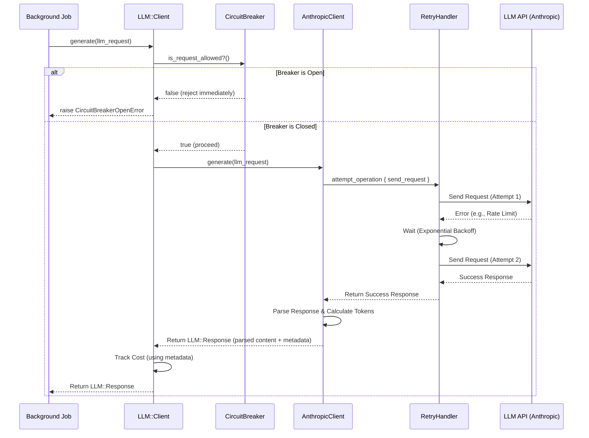

# Chapter 4: LLM Integration & Resilience

In [Chapter 3: Google Drive Integration & Document Selection](03_google_drive_integration___document_selection_.md), we saw how GradeBot securely identifies *which* student documents need grading. Now, how does GradeBot actually *understand* those documents and generate helpful feedback or even create a grading rubric from scratch?

This is where the magic of Artificial Intelligence (AI) comes in, specifically using **Large Language Models (LLMs)**. Think of an LLM like Anthropic's Claude or OpenAI's ChatGPT as an incredibly knowledgeable, but external, consultant. GradeBot needs to communicate with this consultant to get tasks done.

This chapter explains how GradeBot manages these conversations reliably.

## Why Talk to an AI Consultant (LLM)?

GradeBot leverages LLMs for complex tasks that require understanding language and context, like:

1.  **Generating Rubrics:** If a teacher provides assignment instructions but no rubric, GradeBot can ask the LLM to create a suitable one based on the instructions.
2.  **Providing Feedback:** GradeBot sends the student's work, the assignment instructions, and the rubric to the LLM, asking it to evaluate the work and generate specific, constructive feedback.
3.  **Summarizing:** GradeBot can ask the LLM to summarize individual student work or even create an overall summary for the entire assignment.

These tasks are too complex for simple programming rules; they need the nuanced understanding that LLMs provide.

## The Challenge: Talking to an External Expert

Communicating with an external service like an LLM API (Application Programming Interface - a way for computer programs to talk to each other) isn't always straightforward:

*   **The Line Might Be Busy:** The LLM service might be overloaded with requests from many users and respond slowly or give a temporary error.
*   **The Line Might Drop:** Network issues could interrupt the communication.
*   **The Consultant Speaks Differently:** Each LLM provider (like Anthropic or OpenAI) has its own specific way of receiving requests and sending back responses.
*   **Misunderstandings:** We need to make sure our request (the "prompt") is clear so the LLM gives us the kind of response we expect, and we need to understand the response format.

GradeBot needs a robust system to handle these potential issues – a specialized **Communication Department** for talking to the LLM consultant.

## GradeBot's LLM Communication Department

In GradeBot, this "department" is implemented primarily through a set of cooperating components, often centered around a main entry point like `LLM::Client`. Its job is to:

1.  **Prepare the Message:** Take the information needed (like assignment instructions) and format it into a clear "prompt" the LLM can understand.
2.  **Send the Message Reliably:** Send the request to the correct LLM API endpoint.
3.  **Handle Communication Glitches:** If there's a temporary error (like a busy signal), automatically try again a few times (Retries). If errors persist, temporarily stop trying to avoid overloading the service (Circuit Breaker).
4.  **Translate the Response:** Take the LLM's raw answer (often text or JSON) and parse it into a structured format that GradeBot can use (like saving data into our [Core Data Models (ActiveRecord)](02_core_data_models__activerecord__.md)).
5.  **Track Costs:** Keep track of how much each conversation with the LLM costs (more on this in [Chapter 7: Cost Tracking System](07_cost_tracking_system_.md)).

## Using the Communication Department: A Simple Example

Imagine we're building the "Generate Rubric" feature discussed in [Chapter 1: Assignment Lifecycle & Processing](01_assignment_lifecycle___processing_.md). A background job needs to ask the LLM to create a rubric based on the teacher's instructions.

Instead of handling all the complexity of API calls, retries, and parsing directly, the job can simply ask our `LLM::Client` to handle it:

```ruby
# Simplified example inside a background job or service

# 1. Get the assignment instructions and context
assignment_instructions = "Write a 5-paragraph essay analyzing the main themes in Chapter 3 of 'The Great Gatsby'."
context = { subject: "English Language Arts", grade_level: "11th Grade" }

# 2. Prepare the request for the LLM Client
llm_request = LLM::Request.new(
  user: current_user, # For tracking purposes
  request_type: :rubric_generation,
  prompt_data: {
    instructions: assignment_instructions,
    context: context
  }
)

# 3. Ask the LLM Client to handle the communication
begin
  llm_response = LLM::Client.generate(llm_request)

  # 4. Use the parsed response (assuming success)
  # The client returns a structured response object, not just raw text.
  generated_rubric_data = llm_response.parsed_content # e.g., a Hash or custom object
  puts "Successfully generated rubric data: #{generated_rubric_data}"
  # ... now save this data to the Rubric models ...

rescue LLM::Errors::BaseError => e
  # 5. Handle potential errors gracefully
  puts "Failed to generate rubric: #{e.message}"
  # ... maybe mark the assignment step as failed, notify the user ...
end
```

**What's happening here?**

1.  We gather the necessary input (instructions, context).
2.  We package this into a `LLM::Request` object, telling the client *what* we want (`:rubric_generation`) and *who* is asking (`user`).
3.  We call `LLM::Client.generate`. This is the key step – we delegate the complex communication task.
4.  If successful, `llm_response` contains the LLM's answer, already parsed into a usable format (`parsed_content`).
5.  If anything goes wrong during the communication (network error, LLM error, too many retries failed), the `LLM::Client` raises a specific error (like `LLM::Errors::BaseError` or a more specific subclass) that we can catch and handle appropriately.

This makes the background job's code much simpler and focused on *what* needs to happen (get a rubric), not *how* to talk to the LLM.

## Under the Hood: How the LLM Client Works

Let's trace what happens when `LLM::Client.generate` is called, using our "Communication Department" analogy.

**Step-by-Step (Conceptual):**

1.  **Request Received:** The `LLM::Client` (the front desk) receives the `llm_request`.
2.  **Circuit Breaker Check:** It first checks a "circuit breaker". If there have been too many recent failures talking to this specific LLM, the breaker might be "open", meaning the client immediately rejects the request without even trying, preventing further load on a potentially struggling service. Assume the breaker is "closed" (everything looks okay).
3.  **Choose the Right Expert:** A `ClientFactory` might determine *which* LLM to use (e.g., Anthropic's Claude) based on the request or configuration. It gets the specific client instance (e.g., `AnthropicClient`).
4.  **Prepare the Message:** The client uses a `PromptBuilder` to combine the `prompt_data` (instructions, context) with a predefined template, creating the final text prompt sent to the LLM.
5.  **Send and Retry:** The specific client (`AnthropicClient`) sends the prompt to the Anthropic API endpoint.
    *   If the API responds successfully, great! Proceed to step 6.
    *   If the API returns a *retryable* error (like "rate limit exceeded" or "server temporarily overloaded"), a `RetryHandler` catches it. It waits a short period (using exponential backoff – waiting longer each time) and tries sending the request again, up to a few times.
    *   If the API returns a *non-retryable* error (like "invalid request") or the retries fail, an error is raised.
6.  **Parse the Response:** Assuming a successful response, the client receives the raw data (often JSON). It parses this data, extracting the meaningful content (the generated rubric structure) and maybe metadata (like how many tokens were used for cost tracking).
7.  **Track Cost:** The client (often via the `BaseClient`) records how many input and output tokens were used, calculates the cost using `CostCalculator`, and stores it using `CostTracker` (see [Chapter 7: Cost Tracking System](07_cost_tracking_system_.md)). This might happen directly or via an event system.
8.  **Return Result:** The client packages the parsed content and metadata into a `LLM::Response` object and returns it to the original caller (our background job).

**Sequence Diagram:**



## Key Code Components (Simplified View)

Let's peek at simplified versions of the key players:

**1. `LLM::Client` (Entry Point - `app/services/llm/client.rb`)**

```ruby
# app/services/llm/client.rb (Simplified)
module LLM
  class Client
    def self.generate(request)
      # 1. Check the circuit breaker first
      raise Errors::CircuitBreakerOpenError unless CircuitBreaker.allow_request?

      # 2. Get the specific client (e.g., Anthropic) via a factory
      provider_client = ClientFactory.build(request.model) # Simplified

      # 3. Delegate the actual work, potentially wrapping in more checks
      provider_client.generate(request)

    rescue Errors::BaseError => e
      # Maybe record failure for circuit breaker before re-raising
      CircuitBreaker.record_failure
      raise e # Propagate the error
    end
  end
end
```

This acts as the main gatekeeper, checking the circuit breaker and delegating to the appropriate provider-specific client.

**2. `LLM::BaseClient` (Shared Logic - `lib/llm/base_client.rb`)**

```ruby
# lib/llm/base_client.rb (Simplified)
module LLM
  class BaseClient
    def generate(request)
      start_time = Time.now
      response = nil

      # Core logic: build prompt, execute request (with retries), parse
      prompt = build_prompt(request) # Abstract method or uses PromptBuilder
      raw_response = execute_request_with_retries(prompt, request.model) # Uses RetryHandler internally
      response = parse_response(raw_response) # Abstract method

      # Timing and Cost Tracking (Simplified - see Chapter 7)
      duration = (Time.now - start_time) * 1000
      track_cost(request, response, duration) # Simplified call

      return response # Return the structured LLM::Response
    end

    private

    # Methods to be implemented by subclasses (like AnthropicClient)
    def build_prompt(request)
      # ... uses PromptBuilder ...
      raise NotImplementedError
    end

    def execute_request_with_retries(prompt, model)
      # ... uses RetryHandler wrapping the actual API call ...
      raise NotImplementedError
    end

    def parse_response(raw_response)
      # ... logic to process the LLM's specific output format ...
      raise NotImplementedError
    end

    def track_cost(request, response, duration)
       # ... Calls CostTracking services (Chapter 7) ...
    end
  end
end
```

This abstract class defines the overall workflow (build, execute, parse, track) and handles common tasks like timing and cost tracking setup. Provider-specific clients inherit from this.

**3. `LLM::Anthropic::Client` (Specific Provider - `lib/llm/anthropic/client.rb`)**

```ruby
# lib/llm/anthropic/client.rb (Simplified)
module LLM
  module Anthropic
    class Client < BaseClient # Inherits from BaseClient

      private

      def build_prompt(request)
        # Use PromptBuilder with Anthropic-specific formatting
        PromptBuilder.build(request: request, format: :anthropic)
      end

      def execute_request_with_retries(prompt, model)
        RetryHandler.run do # Use the RetryHandler
          # Make the actual call to the Anthropic API library/HTTP client
          # E.g., AnthropicApiService.create_message(model: model, prompt: prompt)
          # ... actual Anthropic API call ...
        end
      end

      def parse_response(raw_response)
        # Logic specific to parsing Anthropic's JSON response
        # Extract content, token counts, etc.
        parsed_content = raw_response.dig("content", 0, "text") # Highly simplified
        token_data = { ... } # Extract token usage
        LLM::Response.new(content: parsed_content, metadata: { tokens: token_data })
      end
    end
  end
end
```

This concrete class implements the methods specific to talking to Anthropic's API, like how to format the prompt, make the actual network call, and parse the unique structure of Anthropic's response.

**4. `LLM::RetryHandler` (Resilience - `lib/llm/retry_handler.rb`)**

```ruby
# lib/llm/retry_handler.rb (Conceptual)
module LLM
  class RetryHandler
    MAX_RETRIES = 3
    INITIAL_WAIT = 1 # second

    def self.run(&block) # Takes a block of code to run
      attempts = 0
      wait_time = INITIAL_WAIT
      begin
        attempts += 1
        return yield # Execute the block (e.g., the API call)
      rescue Errors::ApiOverloadError, Errors::ServiceUnavailableError => e
        # Only retry on specific, temporary errors
        raise e if attempts >= MAX_RETRIES # Stop retrying if limit reached

        sleep(wait_time + rand(0.0..0.5)) # Wait + random jitter
        wait_time *= 2 # Exponential backoff
        retry # Try the 'begin' block again
      rescue => e
        # Don't retry other errors (like bad requests), just raise them
        raise e
      end
    end
  end
end
```

This module provides a way to wrap potentially failing operations (like API calls). It catches specific retryable errors, waits, and tries again, up to a limit.

**5. `LLM::CircuitBreaker` (Resilience - `lib/llm/circuit_breaker.rb`)**

```ruby
# lib/llm/circuit_breaker.rb (Conceptual)
module LLM
  class CircuitBreaker
    FAILURE_THRESHOLD = 5
    RESET_TIMEOUT = 60 # seconds
    # Uses Redis or similar to store state (failures, last failure time, state)

    def self.allow_request?
      # Check current state: :closed, :open, :half_open
      state = get_current_state
      case state
      when :closed
        true # Allow requests
      when :open
        # If open, check if reset timeout has passed
        if Time.now > (get_last_failure_time + RESET_TIMEOUT)
          set_state(:half_open) # Try allowing one request
          true
        else
          false # Still open, reject request
        end
      when :half_open
        # Allow one request through in half-open state
        true
      end
    end

    def self.record_failure
      # Increment failure count
      # Update last failure time
      # If failure count exceeds threshold, set state to :open
      # If in :half_open state, immediately set back to :open on failure
      # ... logic using Redis/cache ...
    end

    def self.record_success
      # If state is :half_open, reset failures and set state to :closed
      # If state is :closed, maybe reset recent failure count
      # ... logic using Redis/cache ...
    end

    # ... helper methods to get/set state, counts, times from Redis ...
  end
end
```

This component tracks recent failures. If too many occur (`FAILURE_THRESHOLD`), it "opens" the circuit, blocking requests for a `RESET_TIMEOUT`. After the timeout, it enters a "half-open" state, allowing one request. If that succeeds, it closes the circuit; otherwise, it opens again. This prevents hammering a failing service.

## Conclusion

Communicating with external LLMs is powerful but requires careful handling. GradeBot's LLM integration layer acts like a dedicated, resilient communication department. It uses components like `LLM::Client`, `RetryHandler`, and `CircuitBreaker` to reliably send requests, handle temporary glitches gracefully, and parse responses into usable formats. This abstraction keeps the rest of the GradeBot code cleaner and more focused on the application's core logic.

Now that we understand how GradeBot handles complex backend tasks like interacting with Google Drive and LLMs, let's shift our focus to the user interface. How does the teacher interact with GradeBot in their web browser? That's where Javascript comes in. In the next chapter, we'll explore how GradeBot uses a specific Javascript framework to make the frontend dynamic and interactive: [Chapter 5: Stimulus Controllers (Frontend Interactivity)](05_stimulus_controllers__frontend_interactivity_.md).

---

Generated by [AI Codebase Knowledge Builder](https://github.com/The-Pocket/Tutorial-Codebase-Knowledge)