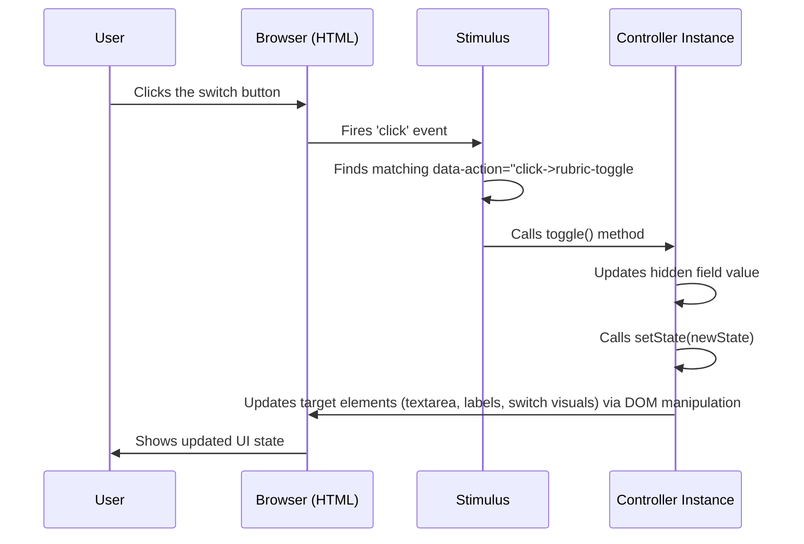

# Chapter 5: Stimulus Controllers (Frontend Interactivity)

In [Chapter 4: LLM Integration & Resilience](04_llm_integration___resilience_.md), we saw how GradeBot talks to powerful AI services in the background. But what about the teacher interacting with GradeBot in their web browser? How do buttons respond instantly, sliders update values, or menus appear without waiting for a full page reload?

This is where **Stimulus** comes in. Think of your web page as a collection of building blocks (HTML elements). Stimulus lets us give specific, small sets of instructions (JavaScript code called "controllers") to individual blocks, telling them how to react when a user interacts with them.

## Why Do We Need This? Making Web Pages Lively

Imagine a simple button on a webpage. When you click it, maybe you want a hidden section to appear, or some text to change, or a calculation to happen *right away*, without the whole page having to reload from the server.

You could write plain JavaScript to do this, but as your application grows, managing all these little interactive pieces can become messy and hard to follow. Stimulus provides a clean, organized way to add this kind of interactivity.

GradeBot uses Stimulus for things like:

*   The button that opens the Google Drive Picker ([Chapter 3: Google Drive Integration & Document Selection](03_google_drive_integration___document_selection_.md)).
*   A slider to choose the desired "tone" for AI feedback.
*   A toggle switch to choose between pasting a rubric and generating one with AI.
*   Mobile menus that slide in and out.

Let's explore how Stimulus makes this happen using the "Rubric Toggle" example.

## The Core Idea: Connecting HTML to JavaScript

Stimulus works by connecting specific JavaScript files (called **controllers**) to HTML elements using special `data-*` attributes. It's like attaching a specific instruction manual to certain parts of your webpage.

Here are the key ingredients:

1.  **Controller (`data-controller`)**: An HTML element with `data-controller="controller-name"` tells Stimulus: "Hey, the instructions in the `controller-name_controller.js` file apply to me and everything inside me."
2.  **Action (`data-action`)**: An attribute like `data-action="event->controller-name#method"` on an element (like a button) says: "When this `event` (e.g., `click`) happens on me, run the `method` inside the `controller-name` controller."
3.  **Target (`data-controller-name-target`)**: An attribute like `data-controller-name-target="element-nickname"` gives a special, easy-to-remember name to an element within the controller's scope. The controller's JavaScript can then easily find and work with this element using `this.elementNicknameTarget`.
4.  **Value (`data-controller-name-value-name-value`)**: An attribute like `data-controller-name-css-class-value="text-red-500"` allows you to pass configuration or initial data from your HTML directly into the controller's JavaScript.

## Example: The Rubric Toggle Switch

On the GradeBot assignment form, the teacher needs to choose how the rubric is handled: either paste one in, or have GradeBot generate it. We use a toggle switch for this.

**The Goal:**

*   Show a visual toggle switch.
*   When clicked, update the switch's appearance.
*   Enable/disable a textarea based on the switch position.
*   Update a hidden form field (`<input type="hidden">`) so the server knows the choice when the form is submitted.
*   Do all this instantly in the browser.

**1. The HTML Structure (Simplified)**

Let's look at a simplified version of the HTML for this toggle.

```html
<!-- Connects this whole section to rubric_toggle_controller.js -->
<div data-controller="rubric-toggle">

  <!-- Hidden field to store the actual choice ('generate' or 'paste') -->
  <input type="hidden" id="rubric_option_field" name="assignment[rubric_option]" value="generate">

  <!-- The visual switch button -->
  <button type="button"
          role="switch"
          aria-checked="true"
          data-action="click->rubric-toggle#toggle"
          data-rubric-toggle-target="switch"
          class="bg-blue-600 ... other classes ...">
    <!-- The moving knob inside the switch -->
    <span data-rubric-toggle-target="knob" class="translate-x-5 ..."></span>
  </button>

  <!-- Text labels (only one shown at a time) -->
  <span data-rubric-toggle-target="generateLabel">Generate with AI</span>
  <span data-rubric-toggle-target="pasteLabel" class="hidden">Paste Rubric</span>

  <!-- The textarea for pasting the rubric -->
  <textarea name="assignment[rubric_text]"
            placeholder="GradeBot will generate..."
            data-rubric-toggle-target="textarea"
            disabled
            class="bg-gray-100 ..."></textarea>
</div>
```

*   `data-controller="rubric-toggle"`: Links this `<div>` and its contents to `rubric_toggle_controller.js`.
*   `data-action="click->rubric-toggle#toggle"`: When the `<button>` is clicked, call the `toggle` method in the controller.
*   `data-rubric-toggle-target="..."`: Gives nicknames (`switch`, `knob`, `generateLabel`, `pasteLabel`, `textarea`) to important elements so the JavaScript can easily find them.
*   The hidden input `id="rubric_option_field"` stores the current state (`generate` or `paste`).

**2. The Stimulus Controller (`rubric_toggle_controller.js`)**

Now, let's look at the corresponding JavaScript file (simplified).

```javascript
// app/javascript/controllers/rubric_toggle_controller.js
import { Controller } from "@hotwired/stimulus"

export default class extends Controller {
  // Declare the nicknames for targets we defined in HTML
  static targets = ["textarea", "switch", "knob", "generateLabel", "pasteLabel"]

  // Declare values (config options passed from HTML, though not shown in simplified HTML above)
  // These often hold CSS classes for different states.
  static values = {
    onBgClass: String, offBgClass: String, // ... other class values
    generatePlaceholder: String, pastePlaceholder: String
  }

  connect() {
    // Called when the controller connects to the HTML element
    console.log("Rubric toggle controller connected!");
    // Find the hidden field
    this.optionField = document.getElementById('rubric_option_field');
    // Set the initial visual state based on the hidden field's value
    if (this.optionField) {
      this.setState(this.optionField.value);
    }
  }

  toggle() {
    // Called when the switch button is clicked (due to data-action)
    if (!this.optionField) return;

    // Figure out the new state and update the hidden field
    const newState = this.optionField.value === 'generate' ? 'paste' : 'generate';
    this.optionField.value = newState;

    // Update the UI visuals
    this.setState(newState);
  }

  setState(state) {
    // Updates the UI based on the current state ('generate' or 'paste')
    const isGenerate = state === 'generate';

    // Make sure the target elements are actually available
    if (!this.hasTextareaTarget || !this.hasSwitchTarget || !this.hasKnobTarget) {
       console.warn("Missing targets!");
       return;
    }

    // 1. Toggle Labels
    if (this.hasGenerateLabelTarget && this.hasPasteLabelTarget) {
      this.generateLabelTarget.classList.toggle('hidden', !isGenerate);
      this.pasteLabelTarget.classList.toggle('hidden', isGenerate);
    }

    // 2. Update Textarea (enable/disable, change placeholder)
    this.textareaTarget.disabled = isGenerate;
    this.textareaTarget.placeholder = isGenerate
        ? this.generatePlaceholderValue // Use placeholder from data-value
        : this.pastePlaceholderValue;
    // Add/remove styling classes if needed (simplified)
    this.textareaTarget.classList.toggle('bg-gray-100', isGenerate);

    // 3. Update Switch Visuals (simplified - uses CSS classes from data-values)
    this.switchTarget.setAttribute('aria-checked', isGenerate.toString());
    // Add/remove background color class
    this.switchTarget.classList.toggle(this.onBgClassValue, isGenerate);
    // Move the knob left/right
    this.knobTarget.classList.toggle(this.knobOnTranslateClassValue, isGenerate);
  }

  disconnect() {
    // Called when the element is removed from the page
    this.optionField = null; // Clean up reference
  }
}
```

*   `static targets = [...]`: Declares the target nicknames used in the HTML (`data-rubric-toggle-target`). Stimulus automatically creates properties like `this.textareaTarget`, `this.switchTarget`, etc.
*   `static values = {...}`: Declares configuration values that can be set in HTML (like `data-rubric-toggle-generate-placeholder-value="..."`). Stimulus creates properties like `this.generatePlaceholderValue`.
*   `connect()`: This is a special Stimulus method called automatically when the controller instance is connected to the `data-controller` element in the HTML. Here, it reads the initial state from the hidden field and sets up the UI.
*   `toggle()`: This is the custom method linked by `data-action`. It updates the hidden field's value and calls `setState` to refresh the UI.
*   `setState(state)`: This method takes the current state ('generate' or 'paste') and updates the appearance and behavior of the target elements (labels, textarea, switch) accordingly. It uses the target properties (e.g., `this.textareaTarget`) and value properties (e.g., `this.generatePlaceholderValue`) provided by Stimulus.
*   `disconnect()`: Called when the element is removed, good for cleanup.

This example shows how Stimulus connects the HTML structure (with `data-` attributes) to a dedicated JavaScript controller, allowing us to manage the state and appearance of a specific UI component cleanly.

## How Stimulus Works (Under the Hood)

You don't need to know the deep internals to use Stimulus, but a basic idea helps:

1.  **Watching the Page:** Stimulus constantly monitors the HTML document for elements with `data-controller` attributes.
2.  **Connecting:** When it finds an element like `<div data-controller="rubric-toggle">`, it:
    *   Looks for a JavaScript class named `RubricToggleController` (it automatically converts `rubric-toggle` to `RubricToggleController`). This class should be imported and registered (usually handled by `app/javascript/controllers/index.js`).
    *   Creates a new instance of this class.
    *   Connects this instance to the `<div>` element.
    *   Calls the `connect()` method on the instance.
3.  **Setting Up:** Stimulus scans the controller element and its children for:
    *   `data-action`: It sets up event listeners (like for 'click') that call the specified controller methods.
    *   `data-rubric-toggle-target`: It makes these elements available as properties like `this.textareaTarget`.
    *   `data-rubric-toggle-...-value`: It reads these values and makes them available as properties like `this.generatePlaceholderValue`.
4.  **Responding:** When an event happens (like a click on the switch button):
    *   The browser fires the event.
    *   Stimulus catches it because of the `data-action`.
    *   It calls the corresponding method (`toggle()` in our example) on the connected controller instance.
    *   The method runs its logic, potentially updating targets or other parts of the UI.

Here's a simplified diagram of the flow when the user clicks the toggle:



## Stimulus in the GradeBot Ecosystem

Stimulus is often described as a "modest" JavaScript framework. It's designed to enhance server-rendered HTML (like the pages GradeBot generates with Ruby on Rails) rather than taking over the entire frontend like frameworks such as React, Vue, or Angular.

It works very well with **Turbo**, another library GradeBot uses (imported in `app/javascript/application.js`). Turbo helps make navigation and form submissions feel faster by avoiding full page reloads, while Stimulus handles the fine-grained interactions on the elements already present on the page.

You can find other Stimulus controllers in GradeBot under `app/javascript/controllers/`. Each one typically manages a specific piece of UI interactivity:

*   `doc_picker_controller.js`: Handles the Google Picker button and displaying selected documents (as seen in [Chapter 3](03_google_drive_integration___document_selection_.md)).
*   `feedback_tone_slider_controller.js`: Updates a hidden field based on a slider's position.
*   `sidebar_controller.js` / `hamburger_controller.js`: Manages the mobile navigation menu.
*   `flash_controller.js`: Shows and hides notification messages.

## Conclusion

Stimulus provides a structured and maintainable way to add JavaScript interactivity to specific parts of your HTML. By using `data-controller`, `data-action`, `data-target`, and `data-value`, you can connect small, focused JavaScript controllers to your user interface elements. This makes the UI feel more responsive and dynamic without the complexity of a heavy frontend framework. You've seen how GradeBot uses it for components like the rubric toggle, and it's a key part of making the user experience smooth.

We've now looked at how GradeBot processes assignments, stores data, interacts with external services like Google Drive and LLMs, and handles frontend interactivity with Stimulus. But how is the complex backend logic, like the multi-step assignment processing, organized? In the next chapter, we'll explore a pattern used heavily in GradeBot to manage complex operations: [Chapter 6: Service Objects Pattern](06_service_objects_pattern_.md).

---

Generated by [AI Codebase Knowledge Builder](https://github.com/The-Pocket/Tutorial-Codebase-Knowledge)