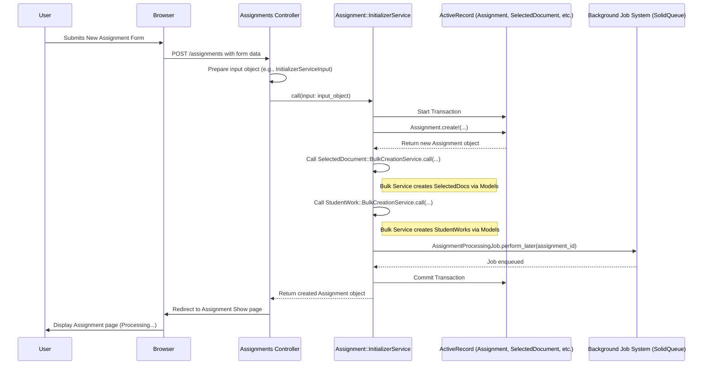

# Chapter 6: Service Objects Pattern

In [Chapter 5: Stimulus Controllers (Frontend Interactivity)](05_stimulus_controllers__frontend_interactivity_.md), we saw how JavaScript controllers make the user interface interactive. Now, let's look back at the backend (the server-side code) and explore how GradeBot organizes complex actions, like setting up a new assignment.

## The Problem: Controllers and Models Doing Too Much

Think back to [Chapter 1: Assignment Lifecycle & Processing](01_assignment_lifecycle___processing_.md). When a teacher submits the "New Assignment" form, several things need to happen:

1.  Create the main `Assignment` record in the database.
2.  Create records for each `SelectedDocument` (the Google Docs chosen).
3.  Create placeholder `StudentWork` records for each document.
4.  Tell the background system to start the actual grading (`AssignmentProcessingJob`).

Where should the code for all these steps live?

*   We could put it all in the `AssignmentsController#create` action. But controllers are supposed to handle web requests and responses, not contain lots of detailed business logic. This would make the controller "fat" and hard to read or test.
*   We could put it in the `Assignment` model ([Chapter 2: Core Data Models (ActiveRecord)](02_core_data_models__activerecord__.md)). But models are primarily for representing data and its relationships, not for orchestrating multi-step processes involving *other* models (like `SelectedDocument` and `StudentWork`).

If we stuff too much logic into controllers or models, our code becomes tangled, difficult to understand, and hard to test or change later.

## The Solution: Specialized Tools (Service Objects)

GradeBot uses a design pattern called the **Service Objects Pattern** to solve this.

Imagine a workshop. Instead of having one giant, clunky multi-tool that tries to do everything poorly, you have specialized tools: a specific wrench for tightening bolts, a specific saw for cutting wood, a specific drill for making holes. Each tool does *one job* really well.

**Service Objects** are like these specialized tools. They are plain Ruby classes designed to perform exactly *one* specific business logic task.

*   Instead of the `AssignmentsController` doing all the setup work, we have an `Assignment::InitializerService` whose only job is to initialize a new assignment and its related records.
*   Instead of the `Assignment::InitializerService` also knowing the details of creating *many* `SelectedDocument` records at once, it uses another specialized tool: `SelectedDocument::BulkCreationService`.

**Key Ideas:**

1.  **Single Responsibility:** Each service object does one thing.
2.  **Plain Ruby:** They are usually simple Ruby classes (sometimes called POROs - Plain Old Ruby Objects), not tightly bound to the web framework like controllers or models.
3.  **Clear Input/Output:** They typically take specific input (often an object or hash) and return a clear result (like the created `Assignment` object or `true`/`false`).
4.  **Follows Command Pattern:** Think of calling a service object like issuing a command: "Initialize this assignment!" or "Bulk create these documents!".

This approach keeps controllers thin (focused on web stuff) and models lean (focused on data), making the overall codebase more organized, easier to test, and simpler to maintain.

## How We Use Service Objects in GradeBot

Let's revisit the `AssignmentsController#create` action from [Chapter 1: Assignment Lifecycle & Processing](01_assignment_lifecycle___processing_.md).

```ruby
# app/controllers/assignments_controller.rb (Simplified)

class AssignmentsController < ApplicationController
  def create
    # 1. Prepare the 'ingredients' for the service object.
    # (Using an Input Object pattern here - Assignment::InitializerServiceInput)
    assignment_input = Assignment::InitializerServiceInput.new(
      user: current_user,
      params: assignment_params # Securely get data from the form
    )

    # 2. 'Call' the specialized tool (the Service Object)
    # This asks the service to perform its single task.
    @assignment = Assignment::InitializerService.call(input: assignment_input)

    # 3. Handle the result from the service
    if @assignment # Service succeeded and returned the new assignment
      redirect_to @assignment, notice: "Assignment created and processing started."
    else # Service failed (e.g., invalid data)
      flash.now[:alert] = "Failed to create assignment. Please check the form."
      render :new, status: :unprocessable_entity
    end
  end

  private

  # Helper to securely get permitted form data
  def assignment_params
    params.require(:assignment).permit(
      :title, :instructions, # ... other fields ...
      document_data: [:googleDocId, :title, :url] # Doc info from Picker
    )
  end
end
```

**Explanation:**

1.  **Prepare Input:** The controller gathers the necessary information from the web request (`assignment_params`) and the logged-in user (`current_user`). It packages this neatly into an `Assignment::InitializerServiceInput` object. This makes it clear what information the service needs.
2.  **Call the Service:** The controller then calls `Assignment::InitializerService.call(...)`. This is the standard way to invoke a service object in GradeBot. It's like picking up the "Assignment Initializer" tool and telling it to run.
3.  **Handle Output:** The `call` method returns the newly created `Assignment` object if successful, or `false` (or raises an error) if it fails. The controller checks this return value and decides whether to redirect the user to the new assignment's page or show the form again with an error message.

Notice how clean the controller is! It doesn't know the *details* of creating assignments, selected documents, or student works. It just prepares the input and delegates the complex task to the specialized service object.

## Inside a Service Object: `Assignment::InitializerService`

Now let's peek inside the specialized tool itself. Where does the actual work happen?

```ruby
# app/services/assignment/initializer_service.rb (Simplified)

module Assignment
  class InitializerService
    attr_reader :assignment # Allows the controller to get the result

    # Convention: A class method 'call' to create and run an instance
    def self.call(input:)
      new(input).call
    end

    # Store the input when a new instance is created
    def initialize(input)
      @input = input
      @assignment = nil # Initialize the result
    end

    # The main instance method where the work happens
    def call
      # Use a transaction: If any step fails, undo everything!
      ActiveRecord::Base.transaction do
        # Step 1: Create the main Assignment record
        @assignment = create_assignment_record

        # Step 2: Delegate bulk document creation to another service
        create_selected_documents

        # Step 3: Delegate bulk student work creation to another service
        create_student_works

        # Step 4: Tell the background system to start processing
        enqueue_processing_job

        # If we reach here, all steps succeeded!
      end # Transaction commits here if no errors

      @assignment # Return the created assignment object

    rescue ActiveRecord::RecordInvalid => e
      # If any 'create!' fails validation, the transaction rolls back.
      Rails.logger.error("Assignment creation failed: #{e.message}")
      false # Indicate failure to the controller
    end

    private # Helper methods specific to this service

    def create_assignment_record
      # Use the Assignment model to create the record
      Assignment.create!(
        title: @input.params[:title],
        instructions: @input.params[:instructions],
        user: @input.user
        # ... other attributes ...
      )
    end

    def create_selected_documents
      # Use another specialized tool (service object)!
      SelectedDocument::BulkCreationService.call(
        assignment: @assignment,
        documents_data: @input.document_data
      )
    end

    def create_student_works
      # Yet another specialized tool!
      StudentWork::BulkCreationService.call(
        assignment: @assignment
      )
    end

    def enqueue_processing_job
      # Tell the background job system (SolidQueue) to run later
      AssignmentProcessingJob.perform_later(@assignment.id)
    end
  end
end
```

**Explanation:**

1.  **`self.call`:** This is a common pattern. The class method `call` creates a new instance of the service (`new(input)`) and then immediately calls the instance method `call`. This makes calling the service from the controller concise: `Assignment::InitializerService.call(...)`.
2.  **`initialize`:** Stores the input data (`@input`) needed for the service's task.
3.  **`call` (instance method):** This is the heart of the service. It performs the specific business logic task.
    *   **Transaction:** It wraps all database operations in `ActiveRecord::Base.transaction`. This is crucial! It ensures that *either all* the database records (Assignment, SelectedDocuments, StudentWorks) are created successfully, *or none* of them are if any step fails (e.g., due to a validation error). This prevents leaving the database in an inconsistent state.
    *   **Clear Steps:** Each step in the process (`create_assignment_record`, `create_selected_documents`, etc.) is handled by a private helper method or delegated to *another* service object (`SelectedDocument::BulkCreationService`, `StudentWork::BulkCreationService`). This keeps the main `call` method readable and focused on the sequence of operations.
    *   **Delegation:** Notice how creating selected documents and student works is delegated. This follows the single responsibility principle – the `InitializerService` orchestrates the overall setup but doesn't need to know the nitty-gritty details of bulk-creating other record types.
    *   **Enqueue Job:** The last step is telling the background job system to take over for the heavy lifting ([Chapter 1: Assignment Lifecycle & Processing](01_assignment_lifecycle___processing_.md)).
    *   **Return Value:** If the transaction completes without errors, it returns the created `@assignment` object.
    *   **Error Handling:** If any `create!` method fails (e.g., the Assignment title is missing and fails validation), an `ActiveRecord::RecordInvalid` error is raised. The `rescue` block catches this, the transaction automatically rolls back (undoes any database changes), logs the error, and returns `false` to the controller.

## Why Use Service Objects? The Benefits

Using this pattern brings several advantages:

1.  **Organization:** Business logic for a specific task is grouped in one place (the service class), making it easier to find and understand. Controllers stay focused on HTTP requests/responses, and models stay focused on data representation.
2.  **Testability:** Service objects are much easier to test than controller actions or complex model methods. You can test a service in isolation by providing its expected input and asserting its output or side effects (like records created or jobs enqueued), without needing to simulate a full web request.
3.  **Reusability:** A service object can potentially be called from multiple places if needed (e.g., a controller, a background job, an administrative script).
4.  **Maintainability:** When the logic for initializing an assignment needs to change, you know exactly where to look: `Assignment::InitializerService`. Changes are localized and less likely to break unrelated parts of the application.

## Under the Hood: The Flow

Let's visualize the typical flow when a controller uses a service object:



This diagram shows how the controller delegates the complex task to the service, which then coordinates with the database models and the background job system, all within a safe transaction.

## Conclusion

The Service Objects pattern is a powerful way to organize complex business logic in your Rails application. By creating small, focused Ruby classes (like specialized tools) that each perform a single task, GradeBot keeps its controllers and models clean and maintainable. We saw how `Assignment::InitializerService` orchestrates the multi-step process of setting up a new assignment, using transactions for safety and delegating sub-tasks to other services.

This pattern helps manage complexity as the application grows. Speaking of complexity, GradeBot needs to track how much its interactions with external AI services cost. In the next chapter, we'll explore how another set of services handles this: [Chapter 7: Cost Tracking System](07_cost_tracking_system_.md).

---

Generated by [AI Codebase Knowledge Builder](https://github.com/The-Pocket/Tutorial-Codebase-Knowledge)