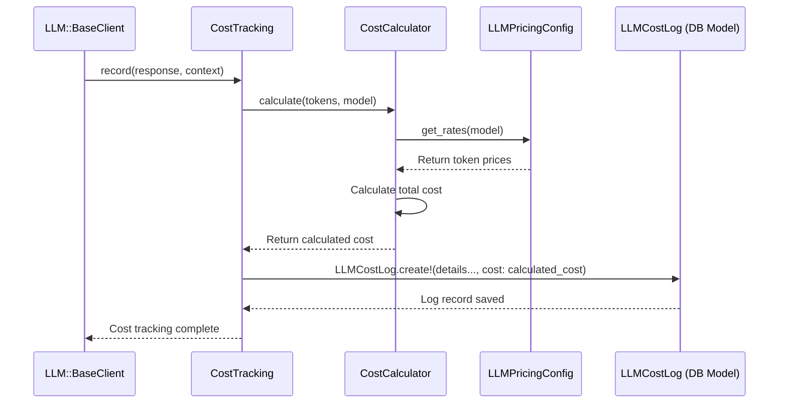

# Chapter 7: Cost Tracking System

In [Chapter 6: Service Objects Pattern](06_service_objects_pattern_.md), we learned how GradeBot organizes complex backend tasks into specialized "tools" called Service Objects. One of the most important (and potentially expensive!) tasks GradeBot performs is communicating with the AI consultant, the Large Language Model (LLM), as we saw in [Chapter 4: LLM Integration & Resilience](04_llm_integration___resilience_.md).

But how do we know how much using this AI consultant actually costs? Just like using electricity, making requests to an LLM isn't free. Each request uses resources (measured in "tokens" - think of them like tiny pieces of words) and the LLM provider charges based on how many tokens are used and which specific AI model is consulted. If we don't track this, our operational costs could spiral out of control!

## The Problem: Keeping AI Costs in Check

Imagine GradeBot is helping hundreds of teachers grade thousands of assignments. Each assignment might involve multiple calls to the LLM: one to generate a rubric, one for each student's feedback, and maybe one for an overall summary. That's a lot of "AI electricity" being used!

We need a way to:

*   **Monitor:** See exactly how much each LLM request costs.
*   **Record:** Keep a log of these costs.
*   **Analyze:** Understand where the costs are coming from (which users? which assignments? which types of requests?).
*   **Control:** Use this information to manage expenses, maybe by optimizing prompts, setting usage limits for different subscription plans, or identifying unexpected cost spikes.

## The Solution: An "AI Electric Meter" (Cost Tracking System)

GradeBot has a dedicated **Cost Tracking System** that acts like an electric meter specifically for its LLM usage. Its job is to precisely measure and record the cost associated with every single conversation GradeBot has with the LLM.

Think of it this way:

*   **The LLM call:** Using the AI consultant (like turning on a powerful appliance).
*   **Tokens:** The amount of "energy" consumed (prompt tokens = energy to ask the question, completion tokens = energy for the answer).
*   **Model Rate:** The price per unit of energy for that specific appliance (different AI models have different prices).
*   **Cost Tracking System:** The meter that measures the energy used and calculates the bill for that specific usage instance.

This system automatically performs several key tasks:

1.  **Captures Usage:** After an LLM request completes successfully, it grabs details like which model was used, how many prompt tokens were sent, and how many completion tokens were received.
2.  **Calculates Cost:** It looks up the price per token for that specific model and calculates the exact cost of that request (often a tiny fraction of a cent, but it adds up!).
3.  **Records Details:** It saves a detailed log entry in the database, including the user who made the request, the assignment it belonged to, the type of request (e.g., `rubric_generation`), the token counts, and the calculated cost.
4.  **Aggregates Data:** This stored data can then be used to generate reports showing total costs per user, per assignment, or overall system costs.

## How Cost Tracking is Triggered

Where does this "meter reading" happen? It typically happens right after a successful LLM interaction. Remember the `LLM::BaseClient` from [Chapter 4: LLM Integration & Resilience](04_llm_integration___resilience_.md)? That's the central component handling LLM communication. It's the perfect place to automatically trigger the cost tracking once the LLM response is received.

```ruby
# Simplified snippet from lib/llm/base_client.rb

module LLM
  class BaseClient
    def generate(request)
      # ... (prepare prompt, time the request) ...

      # Make the actual call to the LLM (via execute_request)
      response = execute_request_with_retries(prompt, request.model) # Assume this succeeded

      # ... (parse the response) ...

      # --- METER READING STEP ---
      # After getting a successful response, track the cost.
      track_cost(request, response) # Call our cost tracking helper

      return response # Return the structured LLM::Response
    end

    private

    def track_cost(request, response)
      # Prepare context for the cost tracking system
      context = {
        user_id: request.user.id,
        assignment_id: request.assignment_id, # If applicable
        request_type: request.request_type,
        model_name: response.model_name # Get model from response
        # ... other relevant details ...
      }
      # Tell the CostTracking system to record this event
      # It uses the response object to get token counts.
      CostTracking.record(response: response, context: context)
    end

    # ... other methods like execute_request_with_retries, parse_response ...
  end
end
```

This `track_cost` method acts as the bridge. It gathers the necessary information (`request` details, `response` including token counts) and passes it to the `CostTracking` system using `CostTracking.record`.

*(Note: The actual GradeBot implementation uses an Event System for this, which is slightly more advanced but achieves the same goal: triggering cost tracking after a request. The direct call shown above illustrates the core idea simply.)*

## Inside the Cost Tracking System: A Step-by-Step Look

What happens when `CostTracking.record` is called?

1.  **Receive Data:** The `CostTracking` service receives the LLM `response` object (which contains token counts) and the `context` hash (with user ID, assignment ID, etc.).
2.  **Calculate Cost:** It passes the token counts and the model name to the `CostCalculator`.
3.  **Look Up Price:** The `CostCalculator` looks up the price per prompt token and per completion token for the specific `model_name` (e.g., from a configuration file or database table like `LLMPricingConfig`).
4.  **Do the Math:** It calculates `prompt_cost = prompt_tokens * prompt_rate` and `completion_cost = completion_tokens * completion_rate`. The total cost is the sum of these two.
5.  **Record Log:** The `CostTracking` service takes the calculated cost and all the context details and passes them to the `CostTracker`.
6.  **Save to Database:** The `CostTracker` creates a new record in the `llm_cost_logs` table (using the `LLMCostLog` model from [Chapter 2: Core Data Models (ActiveRecord)](02_core_data_models__activerecord__.md)) storing all this information permanently.

## Simplified Flow Diagram

Here’s how the main components interact:



## Peeking Inside the Code (Simplified)

Let's look at simplified versions of the key cost tracking components:

**1. `CostCalculator` (Does the Math - `app/services/llm/cost_calculator.rb`)**

```ruby
# app/services/llm/cost_calculator.rb (Simplified)
module LLM
  class CostCalculator
    # Input: Hash with { prompt_tokens: N, completion_tokens: M }, model_name
    # Output: Calculated cost in USD (as a Float or BigDecimal)
    def self.calculate(token_usage, model_name)
      # 1. Get the pricing rates for this specific model
      rates = LLMPricingConfig.get_rates(model_name) # Simplified lookup

      # 2. Get token counts from the input hash
      prompt_tokens = token_usage[:prompt_tokens] || 0
      completion_tokens = token_usage[:completion_tokens] || 0

      # 3. Calculate cost (Rates are often per MILLION tokens)
      prompt_cost = (prompt_tokens * rates[:prompt_rate_usd_per_million]) / 1_000_000.0
      completion_cost = (completion_tokens * rates[:completion_rate_usd_per_million]) / 1_000_000.0

      total_cost = prompt_cost + completion_cost
      total_cost
    end
  end
end
```

This service takes the token counts and model name, finds the pricing, and returns the calculated cost.

**2. `CostTracker` (Saves the Log - `app/services/llm/cost_tracker.rb`)**

```ruby
# app/services/llm/cost_tracker.rb (Simplified)
module LLM
  class CostTracker
    # Input: Calculated cost, response object, context hash
    # Action: Creates a database record
    def self.record(cost:, response:, context:)
      # Extract details needed for the log record
      prompt_tokens = response.prompt_tokens
      completion_tokens = response.completion_tokens
      total_tokens = prompt_tokens + completion_tokens

      # Create the log entry using the LLMCostLog model
      LLMCostLog.create!(
        user_id: context[:user_id],
        assignment_id: context[:assignment_id],
        request_type: context[:request_type],
        model_name: response.model_name,
        prompt_tokens: prompt_tokens,
        completion_tokens: completion_tokens,
        total_tokens: total_tokens,
        cost_usd: cost, # The calculated cost
        # request_id: context[:request_id], # Link back to specific request
        # processing_time_ms: context[:duration] # Optional: store timing
      )
      Rails.logger.info "Cost logged: #{cost} USD for request #{context[:request_id]}"
      true # Indicate success
    rescue ActiveRecord::RecordInvalid => e
      Rails.logger.error "Failed to log cost: #{e.message}"
      false # Indicate failure
    end
  end
end
```

This service takes all the relevant details, including the calculated cost, and uses the `LLMCostLog` ActiveRecord model to save everything to the database.

**3. `LLMCostLog` (The Database Record - `app/models/llm_cost_log.rb`)**

```ruby
# app/models/llm_cost_log.rb (Simplified Structure)
class LlmCostLog < ApplicationRecord
  # Database columns automatically mapped by ActiveRecord:
  # - user_id (integer, links to User)
  # - assignment_id (integer, links to Assignment)
  # - request_type (string, e.g., "rubric_generation")
  # - model_name (string, e.g., "claude-3-opus-20240229")
  # - prompt_tokens (integer)
  # - completion_tokens (integer)
  # - total_tokens (integer)
  # - cost_usd (decimal or float)
  # - request_id (string, unique ID for the LLM call)
  # - processing_time_ms (integer)
  # - created_at, updated_at (timestamps)

  belongs_to :user
  belongs_to :assignment, optional: true # Might not always have an assignment

  # Methods for reporting could be added here, e.g.:
  # scope :for_user, ->(user) { where(user: user) }
  # scope :in_date_range, ->(start_date, end_date) { ... }
  # def self.total_cost_for_period(start, finish) ... end
end
```

This is the ActiveRecord model ([Chapter 2: Core Data Models (ActiveRecord)](02_core_data_models__activerecord__.md)) representing a single row in the `llm_cost_logs` table, storing all the tracked information.

## Using the Tracked Data

Once costs are logged in the database, GradeBot can use this information in various ways:

*   **Dashboards:** Show administrators the total LLM spending over time.
*   **User Usage:** Calculate how much cost a specific user has incurred in a month.
*   **Subscription Limits:** Check if a user on a specific plan has exceeded their allowed usage (maybe measured in cost or number of assignments, which relates back to cost).
*   **Optimization:** Identify which types of LLM requests (e.g., assignment summaries vs. individual feedback) are the most expensive, guiding efforts to make prompts more efficient.

## Conclusion

The Cost Tracking System is a vital behind-the-scenes component in GradeBot. It acts like an "AI electric meter," automatically measuring the token usage of every LLM call, calculating the associated cost based on model rates, and storing detailed logs. This allows GradeBot to monitor operational expenses, analyze usage patterns, and potentially enforce subscription limits based on actual resource consumption. It's crucial for keeping the lights on and ensuring the service remains sustainable!

We've now journeyed through GradeBot's core concepts, from processing assignments and managing data to integrating with external services and handling costs. The final step is to get GradeBot running on a server so teachers can actually use it! In the next chapter, we'll explore how GradeBot is deployed to the cloud using tools like Kamal and Docker: [Chapter 8: Deployment (Kamal & Docker)](08_deployment__kamal___docker__.md).

---

Generated by [AI Codebase Knowledge Builder](https://github.com/The-Pocket/Tutorial-Codebase-Knowledge)