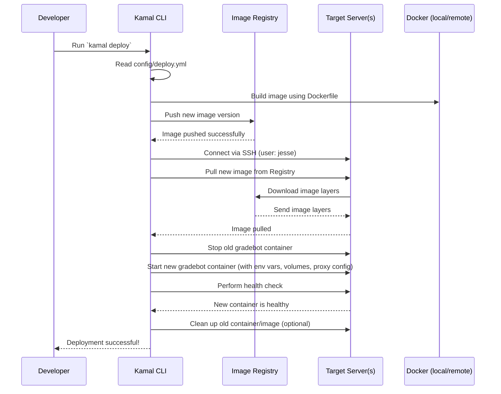

# Chapter 8: Deployment (Kamal & Docker)

Welcome to the final chapter! In [Chapter 7: Cost Tracking System](07_cost_tracking_system_.md), we saw how GradeBot keeps track of the costs associated with using powerful AI services. Now, we have a complete application: it can process assignments, talk to Google Drive, use AI for grading, provide an interactive interface, and track costs. But right now, it likely only runs on a developer's own computer. How do we make GradeBot available on the internet so teachers anywhere can use it?

That's where **Deployment** comes in.

## The Problem: From Our Workshop to the World

Imagine you've built an amazing new invention (GradeBot!) in your workshop (your computer). It works perfectly there. But how do you get it out into the world so people can actually use it? You need to:

1.  **Package it up:** Put the invention and everything it needs to run (tools, materials, power source) into a sturdy, portable box.
2.  **Find a Location:** Choose a place (like a plot of land, which represents a server or cloud computer) where you can set up your invention.
3.  **Set it Up:** Unpack the box, assemble the invention according to instructions, connect it to power, and make sure it's ready for customers.
4.  **Maintain it:** Keep it running smoothly, update it when you make improvements, and fix any problems.

Deployment is the process of doing exactly this for our GradeBot web application. We need to take the code from our development computer and set it up reliably on one or more servers connected to the internet.

## The Solution: Containers and an Orchestrator (Docker & Kamal)

Manually setting up a web application on a server can be tricky. You need to install the right version of Ruby, all the code libraries (gems), configure the database, set up a web server, and manage security. Doing this consistently every time you update the application is hard.

GradeBot uses two key tools to make this process much easier and more reliable:

1.  **Docker (The Shipping Container):** Docker is a tool that lets us package GradeBot and *all* its dependencies (Ruby, system libraries, gems, etc.) into a standardized unit called a **container image**. Think of this image like a blueprint for a self-contained shipping container that has everything GradeBot needs to run, perfectly configured. The actual running container is like the physical shipping container built from the blueprint. Because it's self-contained, a Docker container runs the same way whether it's on a developer's laptop or a production server. The instructions for building this container image are written in a file called `Dockerfile`.

2.  **Kamal (The Foreman/Orchestrator):** Kamal is a deployment tool that takes our Docker container image and manages putting it onto our chosen server(s). It reads instructions from a configuration file (`config/deploy.yml`) which tells it things like:
    *   Where are the servers (the "land")?
    *   Where is the container image stored (the "warehouse")?
    *   What sensitive information (like API keys) does the application need?
    *   How should web traffic be routed to the application (including setting up secure connections like HTTPS)?
    *   Are there any helper services needed (like a database)?

Kamal acts like the foreman on our deployment site. It reads the instruction manual (`deploy.yml`), gets the right shipping container (Docker image), sets it up on the land (server), connects the power (environment variables/secrets), and gets the factory (GradeBot) running. It can also handle updates smoothly.

## How It Works: The Deployment Flow

Here's a typical flow when a developer deploys an update to GradeBot using Kamal and Docker:

1.  **Developer writes code:** Makes changes to GradeBot.
2.  **Developer runs `kamal deploy`:** This single command kicks off the whole process.
3.  **Kamal reads `config/deploy.yml`:** Figures out what needs to be done based on the instructions.
4.  **(Optional) Build Image:** Kamal tells Docker to build a new container image using the instructions in the `Dockerfile`. (This might happen on the developer's machine or a dedicated build server).
5.  **Push Image:** Kamal pushes the newly built image to a **container registry** (like Docker Hub or Google Artifact Registry). This is like putting the new shipping container blueprint in a central warehouse.
6.  **Connect to Servers:** Kamal securely connects to the server(s) listed in `deploy.yml` (using SSH).
7.  **Pull Image:** Kamal tells Docker on the server(s) to download the new image from the registry (getting the container from the warehouse).
8.  **Stop Old Container:** Kamal gracefully stops the old version of the GradeBot container.
9.  **Start New Container:** Kamal starts a new container using the new image, injecting necessary environment variables and secrets, setting up volumes (for persistent storage), and configuring the network proxy.
10. **Health Check & Cleanup:** Kamal checks if the new container started correctly. If so, it might remove the old container and image to save space.

The result? The latest version of GradeBot is now running live on the server(s), ready for teachers to use!

## Key Files: The Blueprints and Instructions

Let's look at the two main configuration files:

**1. `Dockerfile` (The Container Blueprint)**

This file contains step-by-step instructions for Docker on how to build the GradeBot container image. It ensures that everything GradeBot needs is included and set up correctly inside the container.

```dockerfile
# syntax=docker/dockerfile:1

# Use an official Ruby image as the base
ARG RUBY_VERSION=3.2.2
FROM docker.io/library/ruby:$RUBY_VERSION-slim AS base

# Set the working directory inside the container
WORKDIR /rails

# Install essential system packages needed by Rails or gems
RUN apt-get update -qq && \
    apt-get install --no-install-recommends -y curl libjemalloc2 libvips sqlite3 && \
    rm -rf /var/lib/apt/lists /var/cache/apt/archives

# Set environment variables for production
ENV RAILS_ENV="production" \
    BUNDLE_DEPLOYMENT="1" \
    BUNDLE_PATH="/usr/local/bundle" \
    BUNDLE_WITHOUT="development"

# Use a temporary build stage to install gems (keeps final image smaller)
FROM base AS build
# Install build tools
RUN apt-get update -qq && apt-get install --no-install-recommends -y build-essential git pkg-config # ... removed cleanup for brevity
# Copy Gemfile and install gems
COPY Gemfile Gemfile.lock ./
RUN bundle install # ... removed cleanup for brevity
# Copy the rest of the application code
COPY . .
# Precompile assets (CSS, JavaScript) for production
RUN SECRET_KEY_BASE_DUMMY=1 ./bin/rails assets:precompile

# Final stage - copy artifacts from build stage
FROM base
COPY --from=build "${BUNDLE_PATH}" "${BUNDLE_PATH}"
COPY --from=build /rails /rails

# Set up a non-root user to run the application (security best practice)
RUN groupadd --system --gid 1000 rails && \
    useradd rails --uid 1000 --gid 1000 --create-home --shell /bin/bash && \
    chown -R rails:rails db log storage tmp
USER 1000:1000

# Script to run when the container starts (e.g., run database migrations)
ENTRYPOINT ["/rails/bin/docker-entrypoint"]

# Default command to start the Rails web server
EXPOSE 80 # Expose port 80 inside the container
CMD ["./bin/thrust", "./bin/rails", "server"]
```

**Explanation (Simplified):**

*   `FROM ... AS base`: Starts with a basic official Ruby image.
*   `WORKDIR /rails`: Sets the main folder inside the container.
*   `RUN apt-get install ...`: Installs necessary system software.
*   `ENV ...`: Sets up environment variables for production mode.
*   `FROM base AS build ... COPY ... RUN bundle install ...`: A separate stage to install Ruby gems. This helps keep the final image smaller by not including the build tools.
*   `COPY . .`: Copies the GradeBot application code into the image.
*   `RUN ... assets:precompile`: Prepares CSS and JavaScript files for production.
*   `FROM base ... COPY --from=build ...`: Starts the final image stage and copies the installed gems and application code from the build stage.
*   `RUN useradd ... USER ...`: Creates a less privileged user to run the app, which is more secure than running as `root`.
*   `ENTRYPOINT ...`: Specifies a script to run first when the container starts (often used for database setup).
*   `CMD ...`: The default command to run the GradeBot web server.

This `Dockerfile` ensures that every time we build the image, we get a consistent, production-ready environment for GradeBot.

**2. `config/deploy.yml` (Kamal's Instruction Manual)**

This file tells Kamal everything it needs to know to deploy the GradeBot container image to the actual servers.

```yaml
# Name of the application (used for container names, etc.)
service: gradebot

# Location of the Docker image in the registry
# format: REGISTRY_HOST/PROJECT_ID/REPOSITORY/IMAGE_NAME
image: gradebot-451722/repository-1/gradebot

# --- Server(s) ---
servers:
  # Servers running the main web application
  web:
    - 34.44.244.114 # IP address of the server
  # Servers running background jobs (can be the same server)
  job:
    hosts:
      - 34.44.244.114
    cmd: bin/jobs # Command to start the background job worker

# --- Network Proxy (for HTTPS/SSL) ---
proxy:
  ssl: true # Enable automatic SSL certificates via Let's Encrypt
  hosts:
    - grade-bot.com # Domains that point to this app
    - www.grade-bot.com

# --- Image Registry Credentials ---
registry:
  server: us-docker.pkg.dev # e.g., Google Artifact Registry
  username: _json_key_base64 # Special username for registry auth
  password:
    - KAMAL_REGISTRY_PASSWORD # Read password from Kamal secrets

# --- Environment Variables ---
env:
  # Sensitive values read from Kamal's encrypted secrets store
  secret:
    - RAILS_MASTER_KEY
    - GOOGLE_CLIENT_ID
    # ... other secrets (API keys, etc.) ...
  # Non-sensitive values set directly
  clear:
    SOLID_QUEUE_POLLING_INTERVAL: 1
    RAILS_LOG_LEVEL: debug
    JOB_CONCURRENCY: 2 # Number of background job workers

# --- Persistent Storage ---
volumes:
  # Map a directory on the host server to a directory inside the container
  # Used for storing uploaded files, database files (if SQLite), etc.
  - "gradebot_storage:/rails/storage"

# --- SSH User ---
ssh:
  user: jesse # Username to log into the server(s)

# --- Accessories (Optional Helper Services) ---
# Example: Database or Redis (currently commented out)
# accessories:
#   db:
#     image: mysql:8.0
#     host: 192.168.0.2 # Internal IP for the DB container
#     port: "127.0.0.1:3306:3306" # Map port
#     env: ...
#     volumes: ...
```

**Explanation (Simplified):**

*   `service`: Gives the application a name.
*   `image`: Tells Kamal where to find the Docker image in the registry.
*   `servers`: Lists the IP addresses of the servers where the `web` app and background `job` workers should run.
*   `proxy`: Configures Kamal's built-in reverse proxy (Traefik) to handle incoming web traffic, automatically obtain SSL certificates for the specified `hosts`, and route requests to the GradeBot container.
*   `registry`: Provides credentials for Kamal to log in to the container registry to push/pull the image. `KAMAL_REGISTRY_PASSWORD` is stored securely.
*   `env`: Defines environment variables for the running container. `secret` variables are loaded from Kamal's encrypted store (`.kamal/secrets/production.env.enc`), while `clear` variables are set directly. This is how we give the running app sensitive keys and configuration.
*   `volumes`: Sets up persistent storage. Docker containers are normally temporary; anything written inside them is lost when they stop. Volumes link a directory inside the container (e.g., `/rails/storage`) to a directory on the host server (e.g., `gradebot_storage`), so data persists even if the container restarts.
*   `ssh`: Specifies the username Kamal should use to connect to the servers.
*   `accessories`: Allows defining other containers (like a database or Redis cache) that GradeBot might need, managed by Kamal. (These are commented out in the example, meaning GradeBot currently likely uses an external database or runs its background job queue differently).

This `deploy.yml` file is the central configuration for telling Kamal *how* and *where* to deploy GradeBot.

## The Deployment Command in Action

When the developer runs `kamal deploy`, Kamal reads `deploy.yml` and orchestrates the whole process. Here's a simplified view:



This shows how Kamal acts as the central coordinator, interacting with Docker, the registry, and the servers to get the new version of GradeBot running smoothly.

## Conclusion

Deployment is the crucial step that takes GradeBot from a developer's machine to the live internet where teachers can use it. By using Docker, we package GradeBot and all its dependencies into a consistent, portable container image defined by the `Dockerfile`. Kamal then acts as the deployment orchestrator, reading instructions from `config/deploy.yml` to automatically build the image, push it to a registry, pull it onto the target servers, and start/manage the running containers, including handling networking and secrets.

These tools automate a complex process, making deployments faster, more reliable, and easier to manage. Congratulations on completing the GradeBot tutorial! You've journeyed through the entire lifecycle, explored core data models, integrations with Google Drive and LLMs, frontend interactivity, backend patterns like Service Objects, cost tracking, and finally, how GradeBot gets deployed into the real world. You now have a solid foundation for understanding and contributing to the GradeBot project!

---

Generated by [AI Codebase Knowledge Builder](https://github.com/The-Pocket/Tutorial-Codebase-Knowledge)