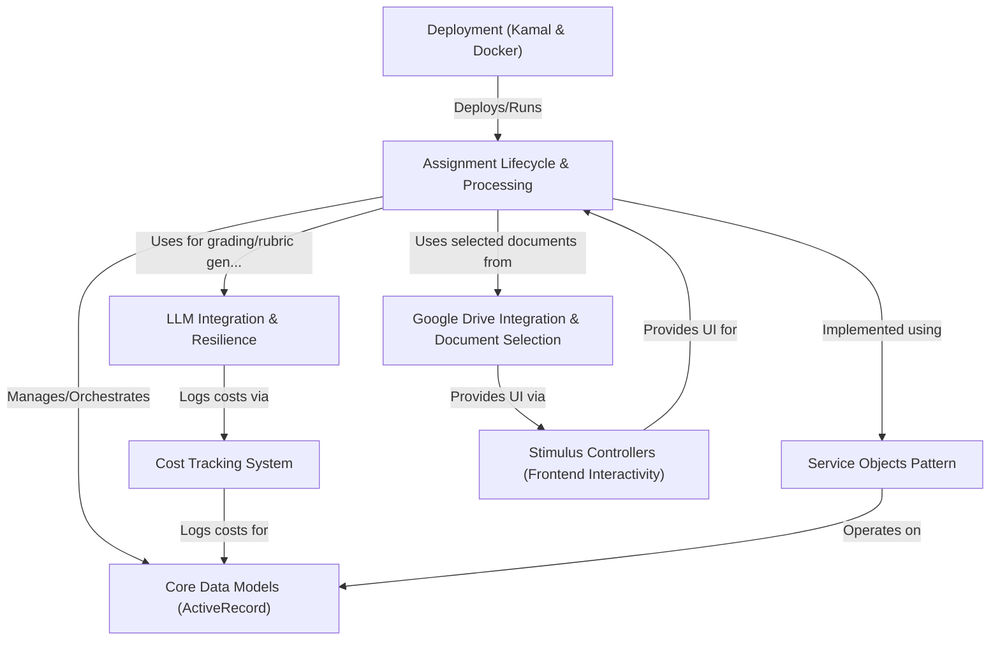

# Tutorial: gradebot

GradeBot is an **AI-powered grading assistant** for teachers.
It helps grade student assignments written in *Google Docs* by integrating with Google Drive.
Teachers create assignments, select student work, and GradeBot uses **Large Language Models (LLMs)** to *automatically generate rubrics* (if needed) and provide *feedback* on the submitted documents.
It aims to save teachers time and provide consistent feedback.

**Source Repository:** [None](None)

## Chapters

1. [Assignment Lifecycle & Processing
](01_assignment_lifecycle___processing_.md)
2. [Core Data Models (ActiveRecord)
](02_core_data_models__activerecord__.md)
3. [Google Drive Integration & Document Selection
](03_google_drive_integration___document_selection_.md)
4. [LLM Integration & Resilience
](04_llm_integration___resilience_.md)
5. [Stimulus Controllers (Frontend Interactivity)
](05_stimulus_controllers__frontend_interactivity__.md)
6. [Service Objects Pattern
](06_service_objects_pattern_.md)
7. [Cost Tracking System
](07_cost_tracking_system_.md)
8. [Deployment (Kamal & Docker)
](08_deployment__kamal___docker__.md)

---

Generated by [AI Codebase Knowledge Builder](https://github.com/The-Pocket/Tutorial-Codebase-Knowledge)